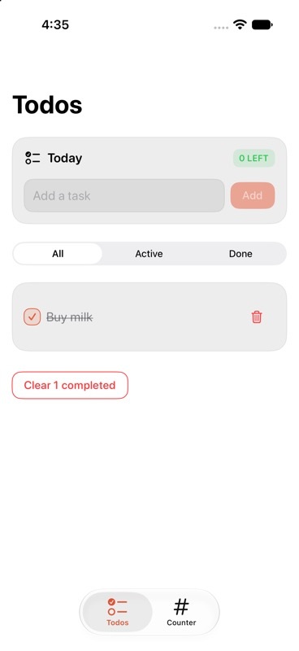
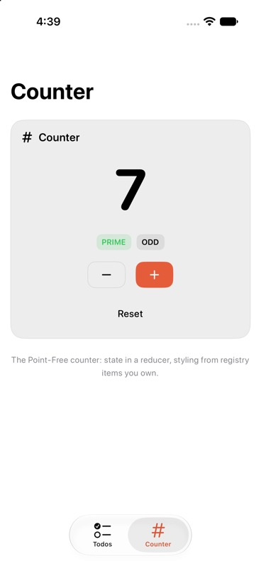

# Todo Counter sample app

A fresh-Xcode-project, any-architecture proof: Composable Architecture drives a todo list, Point-Free's counter; every control native SwiftUI, styled by owned registry items.

| Todos | Counter |
| --- | --- |
|  |  |

Captured: iPhone 17 simulator, iOS 27, 2026-09-06.

Built 2026-09-06, in order:

- URL package: `TodoCounterPackage/Package.swift` deps `swiftui-ui-registry` `0.1.0` (next minor), `swift-composable-architecture` `1.26.2`
- Released tool: `brew install mangobyte-dev/tap/swiftui-registry`; `swiftui-registry install button input card checkbox badge empty separator` (one call per item) into `TodoCounterPackage/Sources/TodoCounterFeature/Registry`, receipt `.swiftui-registry/`
- Theme, shadcn way: `swiftui-registry preset apply a13GkaOXWwIF` wrote `RegistryTheme+App.swift` (coral accent, larger radii, slightly stronger surface); `swiftui-registry preset resolve`: `a2nH36tnmJHJAMzm`, via website's Create page
- Owned: `RegistryBadge.swift` gained uppercase, semibold labels; `swiftui-registry install badge --diff` hunk, `--plan`: `modified-would-require-force`, `--update`: `locally-modified`
- App-wide: `fontDesign(.rounded)` at root, beside `registryTheme(.app)`
- MCP, stdio, from this directory: `swiftui-registry mcp` answered `initialize`, `tools/list`, `search_items`, `describe_item`, `plan_install`, `diff_item`, `describe_preset`

## Three layers, one app

One reducer set, three layers (repository README comparison, one thing at a time): `Variants/Registry`, installed-item styled (default); `Variants/Plain`, stock unstyled; `Variants/Handmade`, own theme tokens/styles, no registry (button, input, card, checkbox-toggle, badge, empty, separator, environment key); `-ui plain`/`-ui handmade` read by `ContentView`.

Non-blank, non-comment lines (`python3 count-lines.py`, 2026-09-06):

| Layer | App-written | Installed/owned |
| --- | --- | --- |
| Registry | 223 lines, 4 files (three views, edited theme) | 651 lines, 7 items, previews included |
| Plain | 154 lines, 3 files | 0 |
| Handmade | 585 lines, 11 files | 0 |

`TodoCounterUITests`: same flow, all layers (registry/handmade uppercase, else identical). `TodoCounterPerformanceTests` (registry/plain/handmade), iPhone 17 simulator iOS 27: `XCTApplicationLaunchMetric` (five launches) 2.97/2.99/2.98s; `XCTClockMetric`, add-five/complete/clear (three runs), 9.17/15.59/9.16s (plain extra: switch animation; stock `Toggle` flips only when tap lands on switch itself). `TodoCounterCaptureTests`: same-state PNGs per layer, `TEST_RUNNER_TODOCOUNTER_CAPTURE_DIR`, source of `docs/images/comparison/`; handmade's todos byte-identical to registry's.

## Run

Open `TodoCounter.xcworkspace`, select `TodoCounter`, run iOS 26+ (Xcode resolves both packages from GitHub, first build). Test plan: feature's `TestStore` tests, one UI test (adds, completes, counts) through registry-styled controls.

## Layout

- `TodoCounter/`: app shell, creates one store, hands to `ContentView`
- `TodoCounterPackage/Sources/TodoCounterFeature/`: `Todos`, `Counter`, `TodoCounter` root reducer, `-ui` switch in `ContentView`, `Variants/` (three layers), `Registry/` (installed items, theme file, receipt)
- `TodoCounterPackage/Tests/`: reducer tests
- `TodoCounterUITests/`: simulator flow
