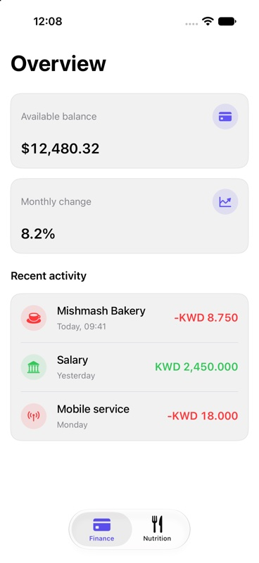
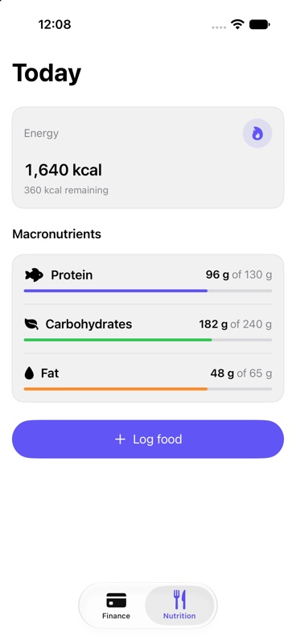

# SwiftUIRegistry

An experimental, native-first composition registry for source-owned SwiftUI product UI

Version 0 tests whether a professional team or coding agent can discover product composition, resolve its dependencies, copy understandable Swift source into an app, customize it, and keep using native SwiftUI architecture

## What exists

- `SwiftUIRegistryFoundations`: a small Swift package product for shared semantic surfaces and spacing
- `metric-card`, `transaction-row`, and `macro-progress`: source-owned product components
- `finance-overview` and `nutrition-overview`: composed, architecture-neutral blocks
- JSON metadata with versions, dependencies, platforms, accessibility notes, previews, and screenshots
- A deterministic metadata search command for developers and agents
- An installer with exact-content receipts, safe repeated installation, and conflict-aware three-way updates
- A universal iOS showcase compiled and tested at the iOS 18 deployment floor
- Pinned visual contract checks for both composed blocks

| Finance | Nutrition |
| --- | --- |
|  |  |

## Discover

Search is local, deterministic, and JSON-first:

```sh
python3 Scripts/search.py nutrition dashboard \
  --kind block \
  --platform iOS \
  --target-version 18.0
```

Results include dependency closure inputs, package requirements, accessibility notes, preview paths, and compatibility metadata. Search does not require a model, MCP server, account, or hosted registry

## Install

The consumer first adds the `SwiftUIRegistryFoundations` package product. Then run:

```sh
python3 Scripts/install.py finance-overview \
  --destination path/to/YourTarget/Components
```

The installer resolves `metric-card` and `transaction-row` before copying `finance-overview`. It writes `.swiftui-registry/receipt.json` and non-Swift base snapshots inside the destination. A repeated install is accepted only when the existing source still matches its receipt. `--force` is required to replace modified owned source

Install another block into the same destination without duplicating shared dependencies:

```sh
python3 Scripts/install.py nutrition-overview \
  --destination path/to/YourTarget/Components
```

## Update owned source

```sh
python3 Scripts/install.py finance-overview \
  --destination path/to/YourTarget/Components \
  --update
```

Update behavior is content-based:

- Unmodified local source receives the registry version
- Local-only edits remain unchanged
- Disjoint local and registry edits are merged with `git merge-file`
- Overlapping edits preserve the owned source and emit a `.merge` artifact under `.swiftui-registry/conflicts/`

The updater never silently resolves a conflict or replaces a customized file

## Compose

```swift
FinanceOverview(
    "Overview",
    balanceTitle: "Available balance",
    balance: Text(balance, format: .currency(code: currencyCode)),
    changeTitle: "Monthly change",
    change: Text(change, format: .percent),
    sectionTitle: "Recent activity",
    transactions: rows,
    onSelect: onSelect
)
```

The block owns presentation composition. The caller owns value preparation, localization catalogs, navigation, state, persistence, scrolling, and container width

## Sample app

Open the universal iOS showcase to inspect both installed blocks on iPhone or iPad:

```sh
open Examples/Showcase/SwiftUIRegistryShowcase.xcworkspace
```

Select the `SwiftUIRegistryShowcase` scheme and run. The app exposes finance and nutrition through native tabs and consumes the exact source installed under `Examples/Showcase/SwiftUIRegistryShowcasePackage/Sources/SwiftUIRegistryShowcaseFeature/Installed/`

The sample also contains launch-driven empty, accessibility-size, and right-to-left states exercised by `SwiftUIRegistryShowcaseUITests.swift`

## Verify

```sh
xcodebuildmcp swift-package test --package-path .
python3 -m unittest discover Tests/RegistryTests
xcodebuildmcp simulator test \
  --workspace-path Examples/Showcase/SwiftUIRegistryShowcase.xcworkspace \
  --scheme SwiftUIRegistryShowcase \
  --simulator-id YOUR_IOS_18_IPHONE_SIMULATOR_ID
```

The simulator suite verifies finance rendering, nutrition navigation, the empty state, accessibility-size typography, right-to-left mirroring, combined transaction semantics, and approved visual references. Baseline policy is documented in `docs/visual-testing.md`

## Requirements

- Swift tools 6.2 or newer
- iOS 18 or newer
- Xcode capable of building Swift 6.2 packages
- Git when an update needs a three-way merge

The repository is currently verified with Xcode 27.0 and Swift 6.4. Registry source intentionally avoids OS 26 or 27-only APIs so the adoption floor remains iOS 18

## Read next

- [Philosophy](docs/philosophy.md)
- [Architecture](docs/architecture.md)
- [Research](docs/research.md)
- [Registry specification](docs/registry-spec.md)
- [Visual testing](docs/visual-testing.md)
- [Contributing](CONTRIBUTING.md)

## Deliberate boundaries

Version 0 does not edit Xcode projects, add package dependencies, host registry content, or expose an MCP server. It also does not claim macOS, watchOS, tvOS, visionOS, or physical-device verification. Those boundaries keep the experiment focused on product composition, source ownership, deterministic discovery, and safe updates

## License

MIT
