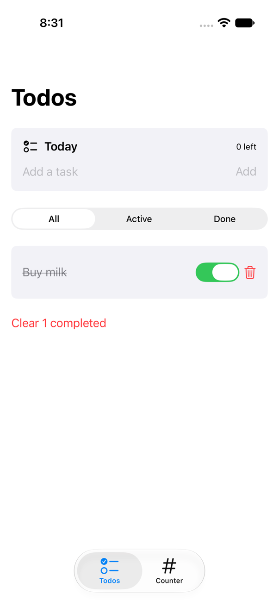
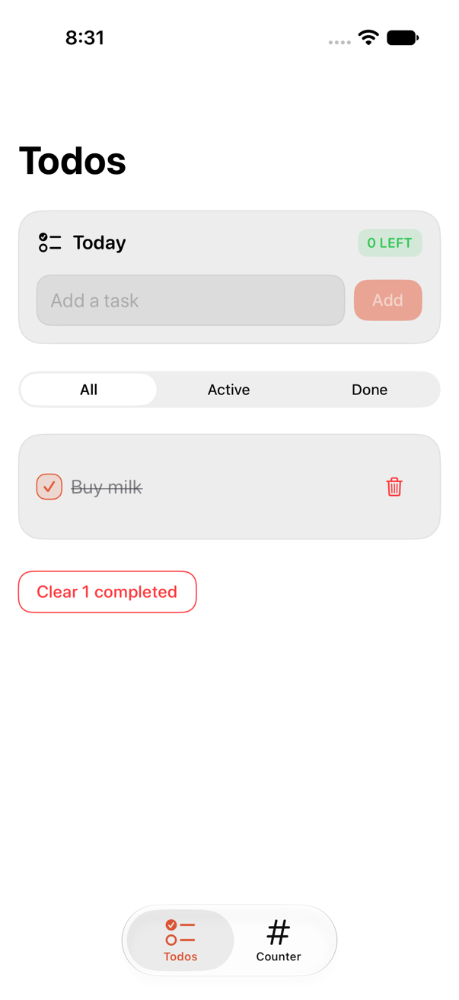
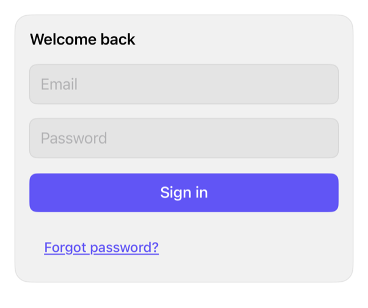
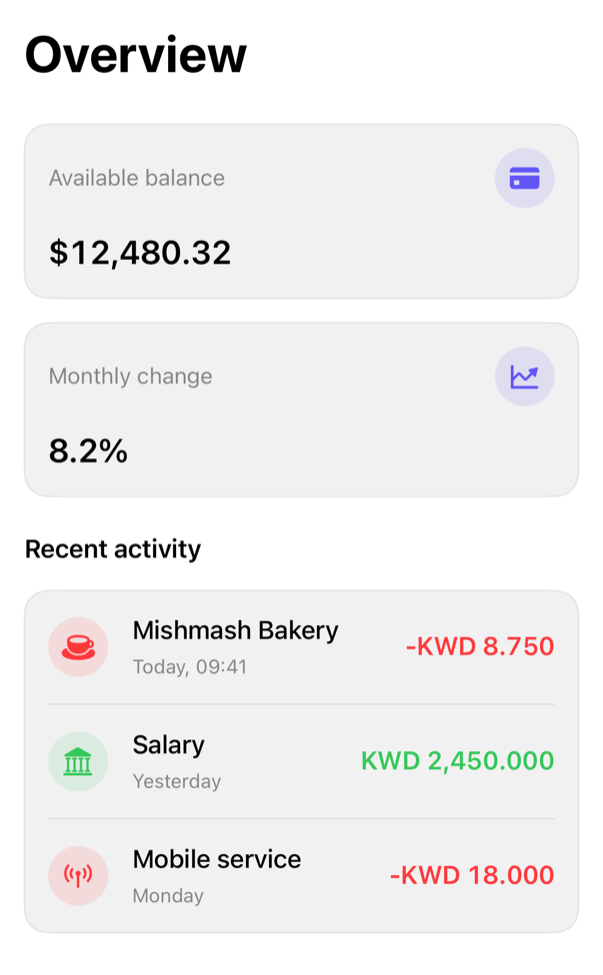
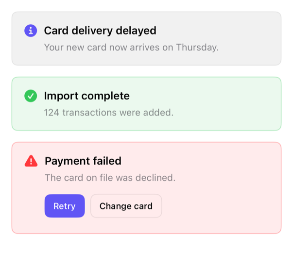
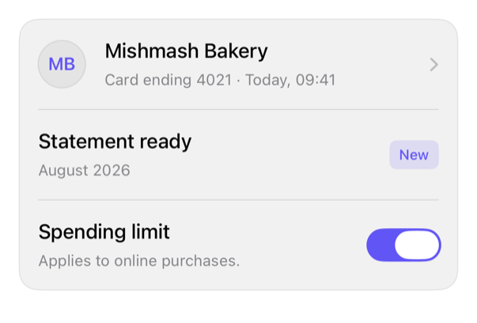

# SwiftUIRegistry

A native-first registry of SwiftUI product UI that you copy into your app and own, in the spirit of shadcn/ui. The unit of distribution is understandable Swift source plus machine-readable metadata, not a framework: set the theme once, search a local catalog, inspect the install plan, copy the code, customize it, and audit updates later through a receipt-backed three-way merge. Apple controls stay visible at the call site

Browse it three ways:

- The website: `Website/`, a Next.js static site built with shadcn/ui. Every item has a page that leads with its rendered preview in light and dark, one install command, the usage snippet, and the full source. Live at https://swiftui-registry.mangobytekw.workers.dev (Cloudflare Workers static assets, `cd Website && npm run deploy`); run it locally with `cd Website && npm ci && npm run dev`
- The Showcase app: `Examples/Showcase/SwiftUIRegistryShowcase.xcworkspace`. Components, Blocks, and Recipes tabs with a live demo per item, and a Tune tab that turns every foundation token into a slider beside a preview and exports the Swift to paste
- The markdown catalog: [docs/catalog/index.md](docs/catalog/index.md)

## Taxonomy

Three item kinds, enforced by a single validator:

- `component`: an installable style, focused modifier, or small composition that adds a meaningful reusable treatment to a native control, such as `button`, `input`, `card`, or `avatar`
- `block`: an installable, architecture-neutral composition of components, such as `auth-form` or `activity-feed`
- `recipe`: native guidance where a one-line Apple API is the entire treatment, such as `switch`, `sheet`, or `context-menu`; nothing installs

The value gate: an installable item must add a meaningful reusable treatment or composition beyond a native API. A wrapper that merely renames an Apple control ships as a recipe instead (`docs/registry-spec.md`)

## Set up once, use it everywhere

1. Add the `SwiftUIRegistryFoundations` package product (SwiftPM snippet below, or File > Add Package Dependency in Xcode)
2. Apply a theme at your scene root. Every registry item below inherits it, and native controls follow the accent through the tint:

   ```swift
   ContentView()
       .registryTheme(.graphite)
   ```

   Presets: `.system` (inherits your app tint), `.graphite`, `.indigo`, `.rose`, `.emerald`, `.amber`, and `.mango`, the sample design system whose template is [docs/mango.md](docs/mango.md). To make your own, open the Showcase's Tune tab, move the sliders, and tap Copy Swift; it exports the exact `RegistryTheme(...)` initializer

3. Install the `swiftui-registry` tool with Homebrew, then install items from any directory. The tool fetches the pinned `0.1.0` registry snapshot from the published tag on first use, caches it under `~/Library/Caches/swiftui-registry`, and reuses it (`--refresh` fetches again). From a clone, `swift run swiftui-registry <command>` runs the same tool against that clone:

   ```sh
   brew install mangobyte-dev/tap/swiftui-registry
   swiftui-registry search activity --kind block --format names
   swiftui-registry install activity-feed --destination path/to/YourTarget/Components --plan
   swiftui-registry install activity-feed --destination path/to/YourTarget/Components
   ```

   The installer resolves the dependency closure, copies exact source, writes `.swiftui-registry/receipt.json`, and prints the package requirement. It never edits project files; make the destination folder a member of your build target. `--registry /path/to/clone` points the tool at a checkout instead of the snapshot

4. Compose through the item's public API; the exact snippet is on its catalog page and in the Showcase

## Why use the registry?

The same todo and counter app was built three times on the same reducers, the Composable Architecture features in `Examples/TodoCounter`, changing only the UI layer: the registry items the app installed and owns, stock SwiftUI with no styling, and the registry's design rewritten by hand without the registry. `-ui plain` and `-ui handmade` launch the alternatives; the registry layer is the default

| Registry | Stock, no styling | Same design by hand |
| --- | --- | --- |
|  |  |  |

Measured on 2026-09-06 on the iPhone 17 simulator, iOS 27, with `Examples/TodoCounter/count-lines.py` (non-blank, non-comment lines; the installed count includes the items' previews) and the app's performance tests:

| | Registry | Stock, no styling | Same design by hand |
| --- | --- | --- | --- |
| Lines you write | 223 in 4 files | 154 in 3 files | 585 in 11 files |
| Lines you own but did not write | 651 in 7 installed items | 0 | 0 |
| Style protocols and modifiers you implement | none | none | ButtonStyle, TextFieldStyle through its underscored `_body`, GroupBoxStyle, ToggleStyle, three ViewModifiers, an environment key, and a theme with 8 colors and 9 metrics |
| Look | the design, themed coral from a preset code | stock controls | the same design; the todos capture is byte-identical to the registry's |
| Change the accent everywhere | one value in `RegistryTheme+App.swift`, or a new preset code | not available | one value, once the theme plumbing exists |
| When the design system improves | `swiftui-registry install --update` merges upstream into your copy and keeps your edits | nothing to update | you port every change by hand |
| Accessibility built in | required labels for icon-only controls, 44 pt hit sizes, boxes that scale with text, a VoiceOver switch representation, RTL and Dynamic Type previews | whatever stock gives | you must know it and write it again |
| App launch, `XCTApplicationLaunchMetric`, 5 runs | 2.97 s | 2.99 s | 2.98 s |
| Add 5 tasks, complete them, clear, `XCTClockMetric`, 3 runs | 9.17 s | 15.59 s | 9.16 s |
| Skills needed | SwiftUI basics and one command | SwiftUI basics | style protocols, environment plumbing, Dynamic Type, accessibility, dark-mode color, RTL |

The registry costs nothing at runtime against the hand-written styles; those two rows are within noise. The stock layer's slower interaction is the system switch's animation under UI automation, not rendering. What the registry buys is the 585 lines and the skills behind them, once per project, and an update path afterwards. The method, the three layers, and the tests are in [Examples/TodoCounter/README.md](Examples/TodoCounter/README.md)

## Status

Version 0, an honest prototype:

- Every item, generated into `docs/catalog/` and the website's data file; the counts live there, not here
- `SwiftUIRegistryFoundations` is a small pre-1.0 package: accent, on-accent, surface, border, positive, negative, disabled opacity, and metrics, with seven presets and one root modifier
- `SwiftUIRegistryDesignSurface` is an optional second product: add it and `.designSurface()` inside your theme call, and a debug build gets the Showcase's tuning panel on device, with the result persisted as `design-tokens.json` and exported as a preset code any registry tool applies; a release build is unchanged
- Every item carries versioned JSON metadata: dependencies, actionable SwiftPM requirements, platforms, accessibility notes, previews, captured screenshots, and a usage snippet, all checked by one validator
- The installer writes exact-content receipts and performs conflict-aware three-way updates
- The Showcase compiles every installable item and every recipe snippet at the iOS 26 floor, with pinned visual contract checks for the blocks and an accessibility-audited demo walk over all 50 items
- Published 2026-09-06: the `0.1.0` tag and GitHub release with the universal `swiftui-registry` binary, and the Homebrew tap `mangobyte-dev/tap`. Not yet: hosted registry, Xcode project mutation, or platforms beyond iOS. Stage status and open deferrals live in one place, `docs/component-roadmap.md`, Current state

## Showcase screenshots

| Activity feed (Stage 3) | Authentication (Stage 2) | Finance (Stage 1) |
| --- | --- | --- |
|  |  |  |

| Button | Alert | Item row |
| --- | --- | --- |
|  |  |  |

Dark captures sit beside every light one under `docs/images/items/`, and the website switches between them

## Discover

Search is local, deterministic, and JSON-first:

```sh
swiftui-registry search nutrition dashboard \
  --kind block \
  --platform iOS \
  --target-version 26.0
```

Results include dependency closure inputs, package requirements, accessibility notes, preview paths, and compatibility metadata. Search does not require a model, MCP server, account, or hosted registry. Every `swiftui-registry` command below runs from any directory once the tool is installed with Homebrew, as `swift run swiftui-registry ...` from the root of a clone, or as a built binary with `--registry /path/to/clone`

## Install

The consumer first adds the `SwiftUIRegistryFoundations` package product. In a SwiftPM consumer, copy this into `Package.swift`:

```swift
// Package.swift
dependencies: [
    .package(url: "https://github.com/mangobyte-dev/swiftui-ui-registry.git", .upToNextMinor(from: "0.1.0"))
]

// In the consuming target's dependencies:
.product(name: "SwiftUIRegistryFoundations", package: "swiftui-ui-registry")
```

The `package:` argument is the SwiftPM package identity for the URL, its last path component without `.git`. In an Xcode app project instead, choose File > Add Package Dependency, enter the same URL with the Up to Next Minor Version rule from 0.1.0, and add the `SwiftUIRegistryFoundations` product to your app target. Then run:

```sh
swiftui-registry install finance-overview \
  --destination path/to/YourTarget/Components
```

The installer resolves `metric-card`, `transaction-row`, and `empty` before copying `finance-overview`. It writes `.swiftui-registry/receipt.json` and non-Swift base snapshots inside the destination. A repeated install is accepted only when the existing source still matches its receipt. `--force` is required to replace modified owned source; it never touches the registry cache, which only `--refresh` does. After an install the tool asks the Homebrew tap for a newer release at most once a day and prints the upgrade command when one exists; a failed check is silent

Verify the install by building the consuming target for an iOS Simulator destination, for example `xcodebuild -scheme YourApp -destination 'generic/platform=iOS Simulator' build`

## Update owned source

```sh
swiftui-registry install finance-overview \
  --destination path/to/YourTarget/Components \
  --update
```

Update behavior is content-based:

- Unmodified local source receives the registry version
- Local-only edits remain unchanged
- Disjoint local and registry edits are merged with `git merge-file`
- Overlapping edits preserve the owned source and emit a `.merge` artifact under `.swiftui-registry/conflicts/`

The updater never silently resolves a conflict or replaces a customized file

## Agent workflow

Both inspection flags are read-only and write nothing, so an agent can preview and audit an installation before touching the destination:

```sh
swiftui-registry install finance-overview \
  --destination path/to/YourTarget/Components \
  --plan
```

`--plan` resolves the item like a real install and prints the ordered dependency closure with versions and kinds, every target write with its status (`new`, `up-to-date`, `modified-would-require-force`, `would-merge`), the actionable package requirements, preflight collisions, and the manual integration steps. For a recipe it prints the native guidance and states nothing installs

```sh
swiftui-registry install finance-overview \
  --destination path/to/YourTarget/Components \
  --diff
```

`--diff` prints a unified diff of each receipt-backed owned file against the canonical registry source. It exits 0 when every file is identical and 1 when differences exist, and it requires an existing installation receipt. Run it before `--update` to see exactly what local customization is at stake

```sh
swiftui-registry describe activity-feed
```

`describe` prints an item before installing it: the name, kind, and version, the description, the call-site usage snippet, the accessibility notes, and, for an installable item, the ordered install closure, the package requirements, and the file targets. `--source` appends each file's canonical content, `--format json` prints the same payload the MCP `describe_item` tool returns, and a recipe reports its native guidance instead of an install closure

```sh
swiftui-registry info --destination path/to/YourTarget/Components
```

`info` reads the receipt already in a destination and reports each installed item with its owned files marked up-to-date, modified, or missing against the digest recorded at install time, ending in a summary count. It never touches the registry, so a consumer can audit an installation without a clone, and it exits 2 when the destination holds no receipt

### MCP server

`swiftui-registry mcp` exposes the same operations (search, describe, plan, diff, install, plus the preset tools) as MCP tools over stdio. Register the Homebrew-installed binary in your MCP client, for example Claude Code's `.mcp.json`; add `"--registry", "/path/to/clone"` to the arguments to serve a checkout instead of the pinned snapshot:

```json
{
  "mcpServers": {
    "swiftui-registry": {
      "command": "swiftui-registry",
      "args": ["mcp"]
    }
  }
}
```

The read-only tools carry `readOnlyHint`; `install_item` carries `destructiveHint` so clients prompt before it writes. Recipes report native guidance and install nothing

## Compose

```swift
ActivityFeed(
    "Activity",
    notice: ActivityNotice("Card delivery delayed", message: Text("Arrives Thursday.")),
    onDismissNotice: { },
    items: items,
    earlierItems: earlier,
    isLoading: isLoading,
    onSelect: onSelect
)
```

The block owns presentation composition. The caller owns value preparation, localization catalogs, navigation, state, persistence, scrolling, and container width

## Sample app

```sh
open Examples/Showcase/SwiftUIRegistryShowcase.xcworkspace
```

Select the `SwiftUIRegistryShowcase` scheme and run. The Components, Blocks, and Recipes tabs list every item from the generated manifest and open a live demo, the install command, and the usage snippet; the tuning panel beside them is the theme creator. The app consumes the exact source installed under `Examples/Showcase/SwiftUIRegistryShowcasePackage/Sources/SwiftUIRegistryShowcaseFeature/Installed/`

A second consumer, `Examples/TodoCounter/TodoCounter.xcworkspace`, was built from a fresh Xcode project on 2026-09-06 to prove the registry works with any architecture: the Composable Architecture drives a todo list and Point-Free's counter, the package comes from GitHub at the `0.1.0` tag, seven items were installed with the Homebrew-installed tool, the theme was applied from a preset code and then customized, and one component carries a local edit the receipt tracks. Its README lists every command that built it

## Verify

```sh
swift run swiftui-registry validate
swift run swiftui-registry generate catalog
swift run swiftui-registry generate showcase-manifest
swift run swiftui-registry generate site-data
swift test
xcodebuildmcp simulator test \
  --workspace-path Examples/Showcase/SwiftUIRegistryShowcase.xcworkspace \
  --scheme SwiftUIRegistryShowcase \
  --simulator-id YOUR_IOS_27_IPHONE_SIMULATOR_ID
```

The simulator suite walks every item's demo, verifies the blocks' behavior (focus order, disabled states, validation copy, bindings, placeholder states, accordion, notice dismissal), the empty state, accessibility-size typography, right-to-left mirroring, the tuning export, and approved visual references. Baseline policy is documented in `docs/visual-testing.md`. Item screenshots are captured with `python3 Scripts/capture_previews.py`

## Requirements

- Swift tools 6.2 or newer
- iOS 26 or newer
- Xcode capable of building Swift 6.2 packages
- Homebrew on macOS for `brew install mangobyte-dev/tap/swiftui-registry`; Swift tools 6.2 or newer to run the tool from a clone instead
- Node 22 for the website and for the website codec check inside `swift test`
- Python 3 only for `Scripts/capture_previews.py`, the maintainer's simulator capture script
- Git when an update needs a three-way merge

The repository is currently verified with Xcode 27.0 and Swift 6.4. The registry targets iOS 26 and above: items inherit Liquid Glass natively, carry no pre-26 compatibility styling, and intentionally avoid 27-only APIs so the floor remains iOS 26

## Read next

- [Website source](Website/) and the [item catalog](docs/catalog/index.md)
- [Philosophy](docs/philosophy.md)
- [Architecture](docs/architecture.md)
- [Component roadmap](docs/component-roadmap.md)
- [Research](docs/research.md)
- [Registry specification](docs/registry-spec.md)
- [Visual testing](docs/visual-testing.md)
- [MANGO design system](docs/mango.md)
- [Agent skills](Skills/): consuming, theming, and authoring the registry in the Point-Free format, mirrored to `~/.claude/skills/`
- [Contributing](CONTRIBUTING.md)

## Deliberate boundaries

Version 0 does not edit Xcode projects, add package dependencies, or host registry content. It also does not claim macOS, watchOS, tvOS, visionOS, or physical-device verification. Those boundaries keep the experiment focused on product composition, source ownership, deterministic discovery, and safe updates

## Security and conduct

Report vulnerabilities privately as described in [SECURITY.md](SECURITY.md); never in a public issue. Participation follows [CODE_OF_CONDUCT.md](CODE_OF_CONDUCT.md). CI runs the registry gate, the website build with a production dependency audit, and a secret scan on every push and pull request

## License

MIT
