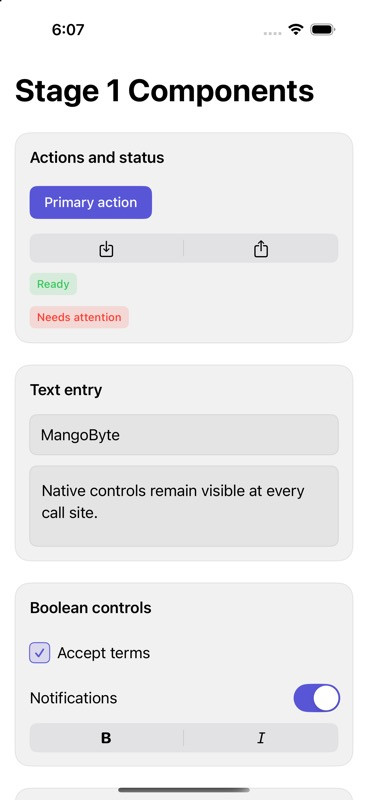
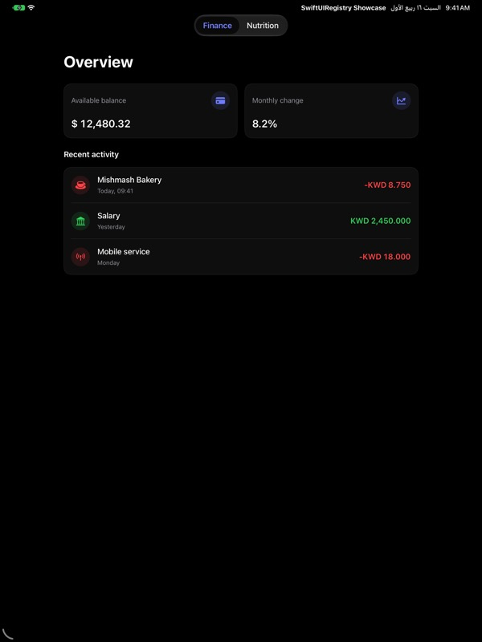
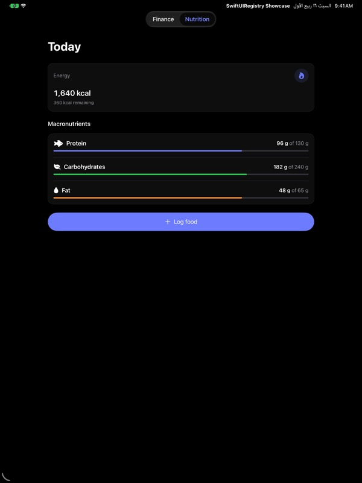
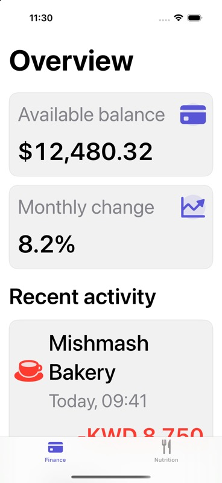

# SwiftUIRegistry

A native-first registry of SwiftUI product UI that you copy into your app and own, in the spirit of shadcn/ui. The unit of distribution is understandable Swift source plus machine-readable metadata, not a framework: search a local catalog, inspect the install plan, copy the code, customize it, and audit updates later through a receipt-backed three-way merge. Apple controls stay visible at the call site

## Taxonomy

Three item kinds, enforced by a single validator:

- `component`: an installable style or focused modifier that adds a meaningful reusable treatment to a native control, such as `button`, `input`, or `card`
- `block`: an installable, architecture-neutral composition of components, such as `finance-overview`
- `recipe`: native guidance where a one-line Apple API is the entire treatment, such as `switch` or `tabs`; nothing installs

The value gate: an installable item must add a meaningful reusable treatment or composition beyond a native API. A wrapper that merely renames an Apple control ships as a recipe instead (`docs/registry-spec.md`)

## Use one item in minutes

Clone this repository first; every `python3 Scripts/...` command below runs from the root of that clone, because there is no hosted registry yet

Browse the generated catalog at [docs/catalog/index.md](docs/catalog/index.md). A component or block page leads with the preview, one install command, and a call-site snippet; a recipe page leads with the snippet because nothing installs. Everything else recedes into Details

1. Find an item:

   ```sh
   python3 Scripts/search.py finance --kind block --format names
   ```

2. Inspect the plan; this is read-only and writes nothing:

   ```sh
   python3 Scripts/install.py finance-overview \
     --destination path/to/YourTarget/Components \
     --plan
   ```

3. Install the item and its dependency closure:

   ```sh
   python3 Scripts/install.py finance-overview \
     --destination path/to/YourTarget/Components
   ```

4. Add the printed package requirement (the `SwiftUIRegistryFoundations` product with its SwiftPM rule) to your project and make the destination folder a member of your build target; the installer never edits project files

5. Compose through the item's public API; the exact snippet is on its [catalog page](docs/catalog/finance-overview.md) and in the Compose section below

## Status

Version 0, an honest prototype:

- 28 items: 17 installable components, 4 blocks, and 7 recipes, generated into `docs/catalog/`
- `SwiftUIRegistryFoundations` is a small pre-1.0 package for shared semantic surfaces and spacing, evolving under the compatibility policy in `docs/registry-spec.md`
- Every item carries versioned JSON metadata: dependencies, actionable SwiftPM requirements, platforms, accessibility notes, previews, and a usage snippet, all checked by one validator
- The installer writes exact-content receipts and performs conflict-aware three-way updates
- A universal iOS showcase compiles and tests every installable item at the iOS 26 floor, with pinned visual contract checks for all four blocks
- Not yet: hosted registry, MCP server, Xcode project mutation, platforms beyond iOS, or external adoption evidence; the first independent clean-room trial is the open gate before Stage 2 (`docs/component-roadmap.md`)

## Showcase screenshots

### Stage 1 component catalog



Launch this catalog with the `-stage-one` argument. The default launch remains the Finance and Nutrition block showcase

### Product blocks

| Finance on iPhone | Nutrition on iPhone |
| --- | --- |
|  |  |

| Finance on iPad | Nutrition on iPad |
| --- | --- |
|  |  |

### Accessibility Dynamic Type



## Discover

Search is local, deterministic, and JSON-first:

```sh
python3 Scripts/search.py nutrition dashboard \
  --kind block \
  --platform iOS \
  --target-version 26.0
```

Results include dependency closure inputs, package requirements, accessibility notes, preview paths, and compatibility metadata. Search does not require a model, MCP server, account, or hosted registry

## Install

The consumer first adds the `SwiftUIRegistryFoundations` package product. In a SwiftPM consumer, copy this into `Package.swift`:

```swift
// Package.swift
dependencies: [
    .package(url: "https://github.com/mangobyte-dev/swiftui-ui-registry.git", .upToNextMinor(from: "0.1.0"))
]

// In the consuming target's dependencies:
.product(name: "SwiftUIRegistryFoundations", package: "swiftui-ui-registry")
```

The `package:` argument is the SwiftPM package identity for the URL, its last path component without `.git`. In an Xcode app project instead, choose File > Add Package Dependency, enter the same URL with the Up to Next Minor Version rule from 0.1.0, and add the `SwiftUIRegistryFoundations` product to your app target. Then run:

```sh
python3 Scripts/install.py finance-overview \
  --destination path/to/YourTarget/Components
```

The installer resolves `metric-card` and `transaction-row` before copying `finance-overview`. It writes `.swiftui-registry/receipt.json` and non-Swift base snapshots inside the destination. A repeated install is accepted only when the existing source still matches its receipt. `--force` is required to replace modified owned source

Verify the install by building the consuming target for an iOS Simulator destination, for example `xcodebuild -scheme YourApp -destination 'generic/platform=iOS Simulator' build`

Install another block into the same destination without duplicating shared dependencies:

```sh
python3 Scripts/install.py nutrition-overview \
  --destination path/to/YourTarget/Components
```

## Update owned source

```sh
python3 Scripts/install.py finance-overview \
  --destination path/to/YourTarget/Components \
  --update
```

Update behavior is content-based:

- Unmodified local source receives the registry version
- Local-only edits remain unchanged
- Disjoint local and registry edits are merged with `git merge-file`
- Overlapping edits preserve the owned source and emit a `.merge` artifact under `.swiftui-registry/conflicts/`

The updater never silently resolves a conflict or replaces a customized file

## Agent workflow

Both inspection flags are read-only and write nothing, so an agent can preview and audit an installation before touching the destination:

```sh
python3 Scripts/install.py finance-overview \
  --destination path/to/YourTarget/Components \
  --plan
```

`--plan` resolves the item like a real install and prints the ordered dependency closure with versions and kinds, every target write with its status (`new`, `up-to-date`, `modified-would-require-force`, `would-merge`), the actionable package requirements, preflight collisions, and the manual integration steps (add the package dependency, ensure target membership). For a recipe it prints the native guidance and states nothing installs

```sh
python3 Scripts/install.py finance-overview \
  --destination path/to/YourTarget/Components \
  --diff
```

`--diff` prints a unified diff of each receipt-backed owned file against the canonical registry source. It exits 0 when every file is identical and 1 when differences exist, and it requires an existing installation receipt. Run it before `--update` to see exactly what local customization is at stake

## Compose

```swift
FinanceOverview(
    "Overview",
    balanceTitle: "Available balance",
    balance: Text(balance, format: .currency(code: currencyCode)),
    changeTitle: "Monthly change",
    change: Text(change, format: .percent),
    sectionTitle: "Recent activity",
    transactions: rows,
    onSelect: onSelect
)
```

The block owns presentation composition. The caller owns value preparation, localization catalogs, navigation, state, persistence, scrolling, and container width

## Sample app

Open the universal iOS showcase to inspect the installed blocks on iPhone or iPad:

```sh
open Examples/Showcase/SwiftUIRegistryShowcase.xcworkspace
```

Select the `SwiftUIRegistryShowcase` scheme and run. The app exposes finance and nutrition through native tabs and consumes the exact source installed under `Examples/Showcase/SwiftUIRegistryShowcasePackage/Sources/SwiftUIRegistryShowcaseFeature/Installed/`

The sample also contains launch-driven empty, accessibility-size, and right-to-left states exercised by `SwiftUIRegistryShowcaseUITests.swift`

## Verify

```sh
xcodebuildmcp swift-package test --package-path .
python3 -m unittest discover Tests/RegistryTests
xcodebuildmcp simulator test \
  --workspace-path Examples/Showcase/SwiftUIRegistryShowcase.xcworkspace \
  --scheme SwiftUIRegistryShowcase \
  --simulator-id YOUR_IOS_27_IPHONE_SIMULATOR_ID
```

The simulator suite verifies finance rendering, nutrition navigation, the empty state, accessibility-size typography, right-to-left mirroring, combined transaction semantics, and approved visual references. Baseline policy is documented in `docs/visual-testing.md`

## Requirements

- Swift tools 6.2 or newer
- iOS 26 or newer
- Xcode capable of building Swift 6.2 packages
- Python 3.8 or newer for every `Scripts/` command; the newest interpreter feature the scripts use is `Path.unlink(missing_ok=)`, added in Python 3.8
- Git when an update needs a three-way merge

The repository is currently verified with Xcode 27.0 and Swift 6.4. The registry targets iOS 26 and above: items inherit Liquid Glass natively, carry no pre-26 compatibility styling, and intentionally avoid 27-only APIs so the floor remains iOS 26

## Read next

- [Item catalog](docs/catalog/index.md)
- [Philosophy](docs/philosophy.md)
- [Architecture](docs/architecture.md)
- [Component roadmap](docs/component-roadmap.md)
- [Research](docs/research.md)
- [Registry specification](docs/registry-spec.md)
- [Visual testing](docs/visual-testing.md)
- [Contributing](CONTRIBUTING.md)

## Deliberate boundaries

Version 0 does not edit Xcode projects, add package dependencies, host registry content, or expose an MCP server. It also does not claim macOS, watchOS, tvOS, visionOS, or physical-device verification. Those boundaries keep the experiment focused on product composition, source ownership, deterministic discovery, and safe updates

## License

MIT
