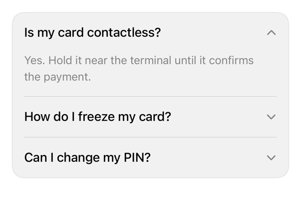

<!-- Generated by `swiftui-registry generate catalog` from Registry metadata. Do not edit by hand; edit the item document and regenerate. -->

# accordion

Styles DisclosureGroup: full-width header, trailing chevron; keeps caller styling.



More previews: [dark](../images/items/accordion-dark.png)

## Install

```sh
swiftui-registry install accordion --destination Sources/YourFeature/Components
```

Point `--destination` at a folder inside the consuming target's sources, such as `Sources/YourFeature/Components`, so the copied files are members of that build target

Then add package https://github.com/mangobyte-dev/swiftui-ui-registry.git (from 0.3.0 up to the next minor version) and link product SwiftUIRegistryFoundations

```swift
// Package.swift
dependencies: [
    .package(url: "https://github.com/mangobyte-dev/swiftui-ui-registry.git", .upToNextMinor(from: "0.3.0"))
]

// In the consuming target's dependencies:
.product(name: "SwiftUIRegistryFoundations", package: "swiftui-ui-registry")
```

In an Xcode app project instead, choose File > Add Package Dependency, enter https://github.com/mangobyte-dev/swiftui-ui-registry.git with the same version rule, and add the SwiftUIRegistryFoundations product to your app target

Verify the install by building the consuming target for an iOS Simulator destination

## Usage

```swift
@State private var isExpanded = false

DisclosureGroup("How do I freeze my card?", isExpanded: $isExpanded) {
    Text("Open the card, then choose Freeze.")
}
.disclosureGroupStyle(.registryAccordion)
```

## Details

- Kind: component
- Version: 0.2.2
- Platforms: iOS 26.0+
- Installs in order: [separator](separator.md) 0.2.1, [accordion](accordion.md) 0.2.2
- Accessibility contract:
  - Header: plain Button bound to isExpanded.
  - Value: Expanded/Collapsed, no selection trait, one-word VoiceOver.
  - Chevron decorative, hidden; header keeps 44 point minimum height.
  - Tap: snappy curve; Reduce Motion immediate; code-driven uses caller's animation.
  - iPad: plain style drops automatic pointer effect; hoverEffect restores, shape auto-picked.
- Source: [sources/components/RegistryAccordionStyle.swift](../../Registry/sources/components/RegistryAccordionStyle.swift), with the `Accordion` Xcode preview
