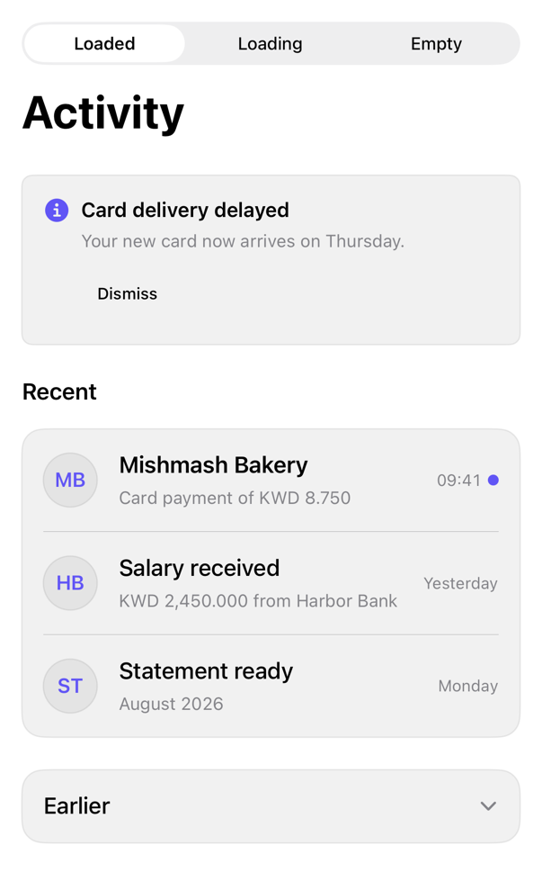

<!-- Generated by Scripts/generate_catalog.py from Registry metadata. Do not edit by hand; edit the item document and regenerate. -->

# activity-feed

Composes inline alert, avatar, item row, skeleton, empty state, and accordion treatments into an activity feed with caller-owned loading, items, notice, and selection.



More previews: [dark](../images/items/activity-feed-dark.png)

## Install

```sh
python3 Scripts/install.py activity-feed --destination Sources/YourFeature/Components
```

Point `--destination` at a folder inside the consuming target's sources, such as `Sources/YourFeature/Components`, so the copied files are members of that build target

Then add package https://github.com/mangobyte-dev/swiftui-ui-registry.git (from 0.1.0 up to the next minor version) and link product SwiftUIRegistryFoundations

```swift
// Package.swift
dependencies: [
    .package(url: "https://github.com/mangobyte-dev/swiftui-ui-registry.git", .upToNextMinor(from: "0.1.0"))
]

// In the consuming target's dependencies:
.product(name: "SwiftUIRegistryFoundations", package: "swiftui-ui-registry")
```

In an Xcode app project instead, choose File > Add Package Dependency, enter https://github.com/mangobyte-dev/swiftui-ui-registry.git with the same version rule, and add the SwiftUIRegistryFoundations product to your app target

Verify the install by building the consuming target for an iOS Simulator destination

## Usage

```swift
ActivityFeed(
    "Activity",
    notice: ActivityNotice("Card delivery delayed", message: Text("Arrives Thursday.")),
    onDismissNotice: { },
    items: [
        ActivityItem(
            id: "bakery",
            title: Text("Mishmash Bakery"),
            detail: Text("Card payment of KWD 8.750"),
            timestamp: Text("09:41"),
            initials: "MB",
            senderName: Text("Mishmash Bakery"),
            isUnread: true
        )
    ],
    earlierItems: [],
    isLoading: false,
    onSelect: { id in }
)
```

## Details

- Kind: block
- Version: 0.1.1
- Platforms: iOS 26.0+
- Installs in order: [button](button.md) 0.5.0, [alert](alert.md) 0.1.1, [avatar](avatar.md) 0.2.0, [separator](separator.md) 0.2.0, [badge](badge.md) 0.3.1, [item](item.md) 0.1.1, [skeleton](skeleton.md) 0.2.0, [empty](empty.md) 0.1.0, [accordion](accordion.md) 0.1.0, [activity-feed](activity-feed.md) 0.1.1
- Accessibility contract:
  - Feedback is never color alone: unread rows use a heavier title, a dot, and an Unread accessibility value; the notice variant pairs a symbol with its color.
  - Loading placeholders are one disabled accessibility element labeled Loading activity and cannot trigger selection.
  - Every avatar carries the caller-provided sender name as its label; the notice symbol and unread dot are decorative and hidden.
  - The empty state is a native ContentUnavailableView with caller-provided copy; the earlier section is a native DisclosureGroup announcing Expanded or Collapsed.
  - Rows are native Buttons whose combined label reads title, detail, timestamp, and unread state.
- Source: [sources/blocks/ActivityFeed.swift](../../Registry/sources/blocks/ActivityFeed.swift), with the `Activity Feed` Xcode preview
