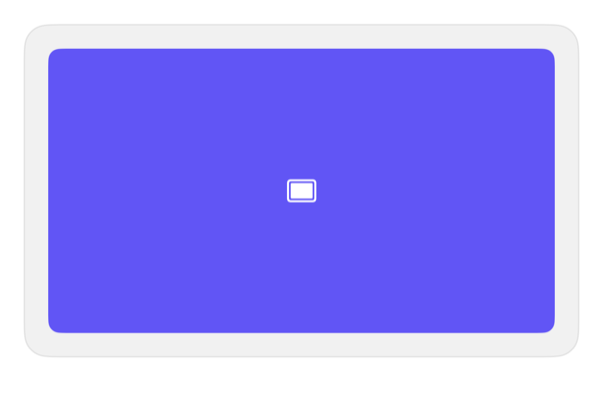

<!-- Generated by `swiftui-registry generate catalog` from Registry metadata. Do not edit by hand; edit the item document and regenerate. -->

# aspect-ratio

Native guidance for SwiftUI's aspectRatio modifier without introducing a replacement API.



More previews: [dark](../images/items/aspect-ratio-dark.png)

Nothing to install. Copy the snippet below

## Usage

```swift
Color.indigo
    .overlay {
        Image(systemName: "play.fill")
            .foregroundStyle(.white)
            .accessibilityHidden(true)
    }
    .aspectRatio(16.0 / 9.0, contentMode: .fit)
    .accessibilityLabel("Video placeholder")

Color.teal
    .aspectRatio(1, contentMode: .fit)
    .frame(maxWidth: 160)
    .accessibilityLabel("Avatar placeholder")
```

## Why native is enough

Use SwiftUI's native `aspectRatio(_:contentMode:)` modifier at the call site. No registry wrapper is needed because the native modifier already preserves parent layout proposals.

## Details

- Kind: recipe
- Version: 0.3.0
- Platforms: iOS 26.0+
- Accessibility contract:
  - Does not change the accessibility semantics of caller content.
  - Keeps meaningful image labels and decorative-image hiding with the caller.
  - Preserves parent layout proposals through the native aspectRatio modifier.
