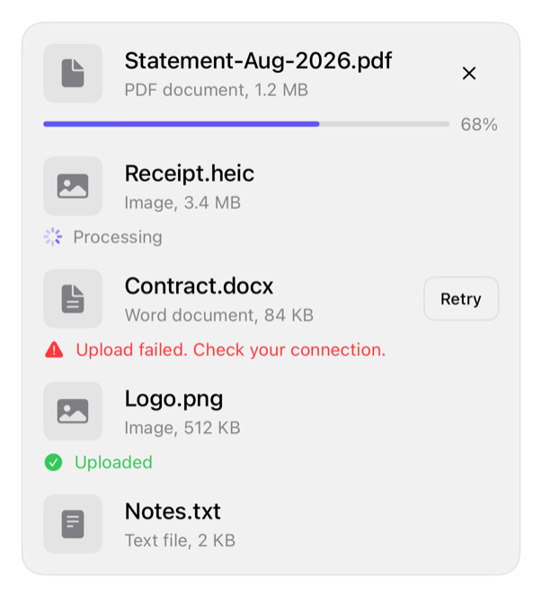

<!-- Generated by `swiftui-registry generate catalog` from Registry metadata. Do not edit by hand; edit the item document and regenerate. -->

# attachment

Presents a file or image attachment as a row with square media, a name and detail, caller-owned actions, and a state line for idle, uploading, processing, failed, and completed uploads.



More previews: [dark](../images/items/attachment-dark.png)

## Install

```sh
swiftui-registry install attachment --destination Sources/YourFeature/Components
```

Point `--destination` at a folder inside the consuming target's sources, such as `Sources/YourFeature/Components`, so the copied files are members of that build target

Then add package https://github.com/mangobyte-dev/swiftui-ui-registry.git (from 0.3.0 up to the next minor version) and link product SwiftUIRegistryFoundations

```swift
// Package.swift
dependencies: [
    .package(url: "https://github.com/mangobyte-dev/swiftui-ui-registry.git", .upToNextMinor(from: "0.3.0"))
]

// In the consuming target's dependencies:
.product(name: "SwiftUIRegistryFoundations", package: "swiftui-ui-registry")
```

In an Xcode app project instead, choose File > Add Package Dependency, enter https://github.com/mangobyte-dev/swiftui-ui-registry.git with the same version rule, and add the SwiftUIRegistryFoundations product to your app target

Verify the install by building the consuming target for an iOS Simulator destination

## Usage

```swift
AttachmentRow(
    name: Text("Statement-Aug-2026.pdf"),
    detail: Text("PDF document, 1.2 MB"),
    state: .uploading(progress: 0.68)
) {
    Image(systemName: "doc.fill")
} actions: {
    Button("Cancel", systemImage: "xmark") {}
        .labelStyle(.iconOnly)
        .buttonStyle(.registryGhost)
        .accessibilityLabel("Cancel upload")
}
```

## Details

- Kind: component
- Version: 0.1.1
- Platforms: iOS 26.0+
- Installs in order: [avatar](avatar.md) 0.2.1, [separator](separator.md) 0.2.1, [badge](badge.md) 0.3.2, [item](item.md) 0.2.1, [progress](progress.md) 0.2.1, [button](button.md) 0.5.2, [attachment](attachment.md) 0.1.1
- Accessibility contract:
  - Every upload state shows text: a percent, Processing, a failure message, or Uploaded. Progress and outcome never rest on color or a bar alone.
  - VoiceOver does not read the upload percent, because the progress bar already reports its value. The same fraction is not read twice.
  - The component composes ItemRow, so the name and detail combine into one accessibility element. The trailing actions stay separately activatable.
  - The failed and completed states each pair their color with a symbol and a word. The outcome does not rest on hue alone.
  - Label any icon-only action button and the thumbnail image. Neither derives an accessibility label from visible text.
- Source: [sources/components/AttachmentRow.swift](../../Registry/sources/components/AttachmentRow.swift), with the `Attachment Row` Xcode preview
