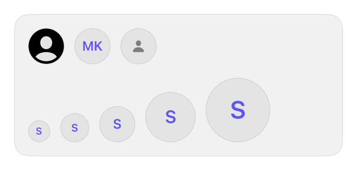

<!-- Generated by `swiftui-registry generate catalog` from Registry metadata. Do not edit by hand; edit the item document and regenerate. -->

# avatar

Displays a circular identity image with initials or symbol fallback, sized by the environment control size, with a required accessibility label.



More previews: [dark](../images/items/avatar-dark.png)

## Install

```sh
swiftui-registry install avatar --destination Sources/YourFeature/Components
```

Point `--destination` at a folder inside the consuming target's sources, such as `Sources/YourFeature/Components`, so the copied files are members of that build target

Then add package https://github.com/mangobyte-dev/swiftui-ui-registry.git (from 0.2.1 up to the next minor version) and link product SwiftUIRegistryFoundations

```swift
// Package.swift
dependencies: [
    .package(url: "https://github.com/mangobyte-dev/swiftui-ui-registry.git", .upToNextMinor(from: "0.2.1"))
]

// In the consuming target's dependencies:
.product(name: "SwiftUIRegistryFoundations", package: "swiftui-ui-registry")
```

In an Xcode app project instead, choose File > Add Package Dependency, enter https://github.com/mangobyte-dev/swiftui-ui-registry.git with the same version rule, and add the SwiftUIRegistryFoundations product to your app target

Verify the install by building the consuming target for an iOS Simulator destination

## Usage

```swift
Avatar(Image("maya"), accessibilityLabel: Text("Maya Khalid"))

Avatar(initials: "MK", accessibilityLabel: Text("Maya Khalid"))
    .controlSize(.large)

Avatar(accessibilityLabel: Text("Unknown sender"))
```

## Details

- Kind: component
- Version: 0.2.1
- Platforms: iOS 26.0+
- Registry dependencies: none
- Accessibility contract:
  - Requires a caller-supplied accessibility label because a face or monogram cannot be derived from visible content.
  - Exposes one image-trait accessibility element and ignores its inner text and symbol.
  - Initials use the tint color on the surface fill; the whole avatar scales with the body text style, so the monogram and symbol keep their size relative to the text beside them.
  - Diameter follows the environment controlSize from 24 to 72 points at the default text size; the border uses the semantic border token.
- Source: [sources/components/Avatar.swift](../../Registry/sources/components/Avatar.swift), with the `Avatar` Xcode preview
