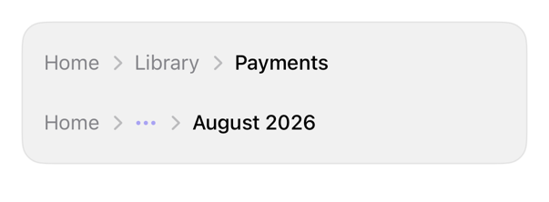

<!-- Generated by `swiftui-registry generate catalog` from Registry metadata. Do not edit by hand; edit the item document and regenerate. -->

# breadcrumb

Horizontal nav trail: chevron separators, current page; overflow holds excess crumbs. iOS: no native breadcrumb.



More previews: [dark](../images/items/breadcrumb-dark.png)

## Install

```sh
swiftui-registry install breadcrumb --destination Sources/YourFeature/Components
```

Point `--destination` at a folder inside the consuming target's sources, such as `Sources/YourFeature/Components`, so the copied files are members of that build target

Then add package https://github.com/mangobyte-dev/swiftui-ui-registry.git (from 0.3.0 up to the next minor version) and link product SwiftUIRegistryFoundations

```swift
// Package.swift
dependencies: [
    .package(url: "https://github.com/mangobyte-dev/swiftui-ui-registry.git", .upToNextMinor(from: "0.3.0"))
]

// In the consuming target's dependencies:
.product(name: "SwiftUIRegistryFoundations", package: "swiftui-ui-registry")
```

In an Xcode app project instead, choose File > Add Package Dependency, enter https://github.com/mangobyte-dev/swiftui-ui-registry.git with the same version rule, and add the SwiftUIRegistryFoundations product to your app target

Verify the install by building the consuming target for an iOS Simulator destination

## Usage

```swift
Breadcrumb([
    BreadcrumbItem(Text("Home"), action: { path = NavigationPath() }),
    BreadcrumbItem(Text("Library"), action: { path.removeLast() }),
    BreadcrumbItem(Text("Payments"))
])
```

## Details

- Kind: component
- Version: 0.1.2
- Platforms: iOS 26.0+
- Registry dependencies: none
- Accessibility contract:
  - One container: Breadcrumb; links navigable; current: header trait, not button.
  - Chevrons decorative, hidden; overflow: Show more, lists crumbs.
  - chevron.forward mirrors RTL; reverses with layout direction.
  - ViewThatFits collapses middle crumbs past width; links compact inline; back stays primary.
  - iPad: plain style drops pointer effect; hoverEffect restores, shape auto-picked.
- Source: [sources/components/Breadcrumb.swift](../../Registry/sources/components/Breadcrumb.swift), with the `Breadcrumb` Xcode preview
