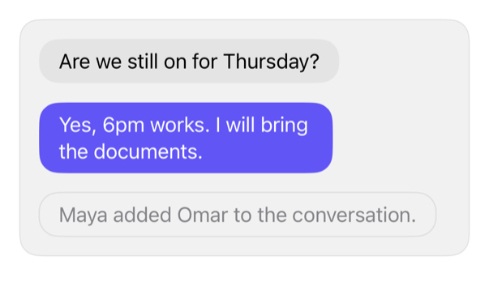

<!-- Generated by `swiftui-registry generate catalog` from Registry metadata. Do not edit by hand; edit the item document and regenerate. -->

# bubble

Wraps text content in an incoming, outgoing, or muted conversation bubble as a reusable treatment, leaving alignment to the message row.



More previews: [dark](../images/items/bubble-dark.png)

## Install

```sh
swiftui-registry install bubble --destination Sources/YourFeature/Components
```

Point `--destination` at a folder inside the consuming target's sources, such as `Sources/YourFeature/Components`, so the copied files are members of that build target

Then add package https://github.com/mangobyte-dev/swiftui-ui-registry.git (from 0.1.0 up to the next minor version) and link product SwiftUIRegistryFoundations

```swift
// Package.swift
dependencies: [
    .package(url: "https://github.com/mangobyte-dev/swiftui-ui-registry.git", .upToNextMinor(from: "0.1.0"))
]

// In the consuming target's dependencies:
.product(name: "SwiftUIRegistryFoundations", package: "swiftui-ui-registry")
```

In an Xcode app project instead, choose File > Add Package Dependency, enter https://github.com/mangobyte-dev/swiftui-ui-registry.git with the same version rule, and add the SwiftUIRegistryFoundations product to your app target

Verify the install by building the consuming target for an iOS Simulator destination

## Usage

```swift
Text("Are we still on for Thursday?")
    .registryBubble(.incoming)

Text("Yes, 6pm works.")
    .registryBubble(.outgoing)
```

## Details

- Kind: component
- Version: 0.1.0
- Platforms: iOS 26.0+
- Registry dependencies: none
- Accessibility contract:
  - Wraps its text freely and never truncates, so a long message stays fully readable and grows with Dynamic Type.
  - Adds no accessibility element of its own; the wrapped Text keeps its semantics and reading order.
  - Incoming and outgoing bubbles carry no stroke and rest on fill alone; the outgoing fill is the tint with the theme's onAccent label, which the caller keeps legible against the accent.
  - The muted variant drops the fill for a border hairline, so a system line reads as distinct from a spoken turn without relying on color.
  - Inherits layout direction, so the bubble's padding and continuous corners follow the caller's locale.
- Source: [sources/components/RegistryBubbleModifier.swift](../../Registry/sources/components/RegistryBubbleModifier.swift), with the `Bubble Variants` Xcode preview
