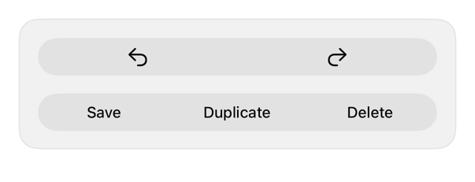

<!-- Generated by Scripts/generate_catalog.py from Registry metadata. Do not edit by hand; edit the item document and regenerate. -->

# button-group

Styles every native button in a ControlGroup with one registry button variant while retaining the system group container.



More previews: [dark](../images/items/button-group-dark.png)

## Install

```sh
python3 Scripts/install.py button-group --destination Sources/YourFeature/Components
```

Point `--destination` at a folder inside the consuming target's sources, such as `Sources/YourFeature/Components`, so the copied files are members of that build target

Then add package https://github.com/mangobyte-dev/swiftui-ui-registry.git (from 0.1.0 up to the next minor version) and link product SwiftUIRegistryFoundations

```swift
// Package.swift
dependencies: [
    .package(url: "https://github.com/mangobyte-dev/swiftui-ui-registry.git", .upToNextMinor(from: "0.1.0"))
]

// In the consuming target's dependencies:
.product(name: "SwiftUIRegistryFoundations", package: "swiftui-ui-registry")
```

In an Xcode app project instead, choose File > Add Package Dependency, enter https://github.com/mangobyte-dev/swiftui-ui-registry.git with the same version rule, and add the SwiftUIRegistryFoundations product to your app target

Verify the install by building the consuming target for an iOS Simulator destination

## Usage

```swift
// Content layer only. In toolbars, tab bars, or floating chrome the system supplies Liquid Glass; use .buttonStyle(.glass) or .buttonStyle(.glassProminent) there instead of .registry styles.

ControlGroup {
    Button("Undo", systemImage: "arrow.uturn.backward") {}
    Button("Redo", systemImage: "arrow.uturn.forward") {}
}
.controlGroupStyle(.registryButtons)
```

## Details

- Kind: component
- Version: 0.2.0
- Platforms: iOS 26.0+
- Installs in order: [button](button.md) 0.4.0, [button-group](button-group.md) 0.2.0
- Accessibility contract:
  - Retains native Button controls and the ControlGroup container supplied by the caller.
  - Keeps each button's visible or derived accessibility label and role.
  - Inherits layout direction, control size, enabled state, and Dynamic Type behavior.
  - Requires callers to provide labels for icon-only buttons through native Button initializers.
- Source: [sources/components/RegistryButtonGroupStyle.swift](../../Registry/sources/components/RegistryButtonGroupStyle.swift), with the `Button Group` Xcode preview
