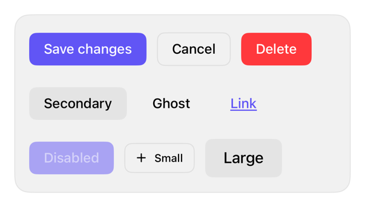

<!-- Generated by `swiftui-registry generate catalog` from Registry metadata. Do not edit by hand; edit the item document and regenerate. -->

# button

Styles native SwiftUI buttons with shadcn-inspired semantic variants while preserving roles and environment sizing.



More previews: [dark](../images/items/button-dark.png)

## Install

```sh
swiftui-registry install button --destination Sources/YourFeature/Components
```

Point `--destination` at a folder inside the consuming target's sources, such as `Sources/YourFeature/Components`, so the copied files are members of that build target

Then add package https://github.com/mangobyte-dev/swiftui-ui-registry.git (from 0.3.0 up to the next minor version) and link product SwiftUIRegistryFoundations

```swift
// Package.swift
dependencies: [
    .package(url: "https://github.com/mangobyte-dev/swiftui-ui-registry.git", .upToNextMinor(from: "0.3.0"))
]

// In the consuming target's dependencies:
.product(name: "SwiftUIRegistryFoundations", package: "swiftui-ui-registry")
```

In an Xcode app project instead, choose File > Add Package Dependency, enter https://github.com/mangobyte-dev/swiftui-ui-registry.git with the same version rule, and add the SwiftUIRegistryFoundations product to your app target

Verify the install by building the consuming target for an iOS Simulator destination

## Usage

```swift
// Content layer only. In toolbars, tab bars, or floating chrome the system supplies Liquid Glass; use .buttonStyle(.glass) or .buttonStyle(.glassProminent) there instead of .registry styles.

Button("Save changes") {}
    .buttonStyle(.registry)

Button("Cancel") {}
    .buttonStyle(.registryOutline)

Button("Delete", role: .destructive) {}
    .buttonStyle(.registry)
```

## Details

- Kind: component
- Version: 0.5.2
- Platforms: iOS 26.0+
- Registry dependencies: none
- Accessibility contract:
  - Preserves native Button semantics and ButtonRole behavior.
  - Maintains a minimum 44 by 44 point interaction area across control sizes.
  - Uses system text styles and keeps the label on one line: it never wraps or breaks, scaling down slightly before truncating, so the call site provides room with a full-width frame or a stacked layout at large text sizes.
  - Reads the enabled state from the environment and preserves the native ButtonRole: a destructive role draws the negative fill in the primary variant and negative label text in the outline, secondary, ghost, and link variants, alongside the caller's label.
  - On iPad the style keeps SwiftUI's automatic pointer effect through hoverEffect(), because a custom ButtonStyle otherwise drops it; measured on the iOS 27 iPad simulator with an XCTest hover, the button's pixels did not change until the effect was restored.
- Source: [sources/components/RegistryButtonStyle.swift](../../Registry/sources/components/RegistryButtonStyle.swift), with the `Button Variants` Xcode preview
