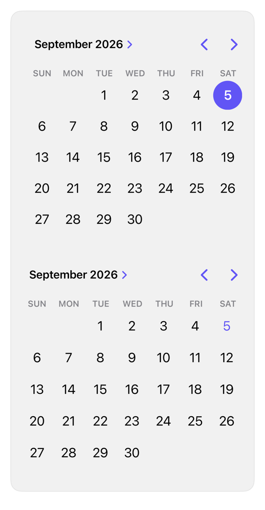

<!-- Generated by `swiftui-registry generate catalog` from Registry metadata. Do not edit by hand; edit the item document and regenerate. -->

# calendar

Native guidance for date selection with DatePicker in graphical style and MultiDatePicker for several dates.



More previews: [dark](../images/items/calendar-dark.png)

Nothing to install. Copy the snippet below

## Usage

```swift
@State private var date = Date.now
@State private var dates: Set<DateComponents> = []

DatePicker("Statement date", selection: $date, displayedComponents: .date)
    .datePickerStyle(.graphical)

MultiDatePicker("Reminder days", selection: $dates)
```

## Why native is enough

Use `DatePicker` with `.datePickerStyle(.graphical)` for a calendar and `MultiDatePicker` for several dates. Both inherit tint, locale, calendar, and layout direction; the registry adds no replacement calendar.

## Details

- Kind: recipe
- Version: 0.1.0
- Platforms: iOS 26.0+
- Accessibility contract:
  - Native date pickers expose adjustable day cells and month navigation to VoiceOver.
  - Locale, first weekday, and right-to-left month order come from the environment.
  - Keep a visible label; the graphical style hides it, so provide surrounding context.
