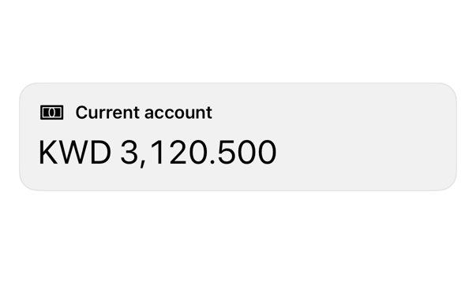

<!-- Generated by `swiftui-registry generate catalog` from Registry metadata. Do not edit by hand; edit the item document and regenerate. -->

# carousel

Native guidance for a paging horizontal ScrollView of cards with scrollTargetBehavior and containerRelativeFrame.



More previews: [dark](../images/items/carousel-dark.png)

Nothing to install. Copy the snippet below

## Usage

```swift
ScrollView(.horizontal) {
    HStack(spacing: 12) {
        ForEach(cards) { card in
            VStack(alignment: .leading, spacing: 8) {
                Label(card.title, systemImage: card.systemImage)
                    .font(.subheadline.weight(.semibold))
                Text(card.amount, format: .currency(code: "KWD"))
                    .font(.title.monospacedDigit())
            }
            .frame(maxWidth: .infinity, alignment: .leading)
            .padding()
            .registrySurface()
            .containerRelativeFrame(.horizontal)
            .accessibilityElement(children: .combine)
            .accessibilityLabel("\(card.title) card")
        }
    }
    .scrollTargetLayout()
}
.scrollTargetBehavior(.paging)
```

## Why native is enough

Lay cards in a horizontal `ScrollView`, mark the row with `.scrollTargetLayout()`, and page with `.scrollTargetBehavior(.paging)`. `containerRelativeFrame(.horizontal)` sizes each page to the viewport. For a page control instead, use a `TabView` with `.tabViewStyle(.page)`. The system supplies the paging, the indicators, and the Reduce Motion behavior, so the registry adds no wrapper. Watch the page width: a card must fill the container relative frame, or paging stops on partial cards.

## Details

- Kind: recipe
- Version: 0.1.0
- Platforms: iOS 26.0+
- Accessibility contract:
  - Paging scroll views are native and support VoiceOver page scrolling and the three-finger scroll gesture.
  - Give each page an accessibility label; a card combined from several texts should read as one element.
