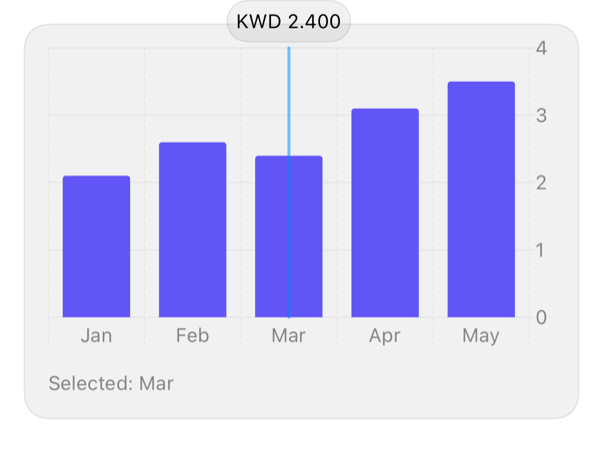

<!-- Generated by `swiftui-registry generate catalog` from Registry metadata. Do not edit by hand; edit the item document and regenerate. -->

# chart-tooltip

Native guidance for a Swift Charts selection annotation with chartXSelection and a RuleMark tooltip.



More previews: [dark](../images/items/chart-tooltip-dark.png)

Nothing to install. Copy the snippet below

## Usage

```swift
@State private var selectedMonth: String?

var selected: MonthlyBalance? {
    balances.first { $0.month == selectedMonth }
}

Chart {
    ForEach(balances) { row in
        BarMark(
            x: .value("Month", row.month),
            y: .value("Balance", row.amount)
        )
        .foregroundStyle(TintShapeStyle())
    }
    if let selected {
        RuleMark(x: .value("Month", selected.month))
            .foregroundStyle(.secondary)
            .annotation(position: .top) {
                Text(selected.amount, format: .currency(code: "KWD"))
                    .font(.footnote.monospacedDigit())
                    .padding(6)
                    .registrySurface()
            }
    }
}
.chartXSelection(value: $selectedMonth)
.registryChart()
```

## Why native is enough

Bind `.chartXSelection(value:)` to the mark's category type and, when a value is selected, add a `RuleMark(x:)` with an `.annotation(position: .top)` that shows the figure on a small registry surface. Swift Charts drives the selection from tap and drag; the registry adds only the themed chart treatment through `.registryChart()`, and a single-series mark takes the accent explicitly with `.foregroundStyle(TintShapeStyle())` because Swift Charts draws one series in its own default color otherwise. Keep the annotation content short so it does not overflow the plot. Watch the selection type: it must match the mark's x value type or nothing selects.

## Details

- Kind: recipe
- Version: 0.1.0
- Platforms: iOS 26.0+
- Accessibility contract:
  - Swift Charts exposes each mark to VoiceOver through its audio graph and value descriptions.
  - The selected value is shown as visible text, not by color alone.
