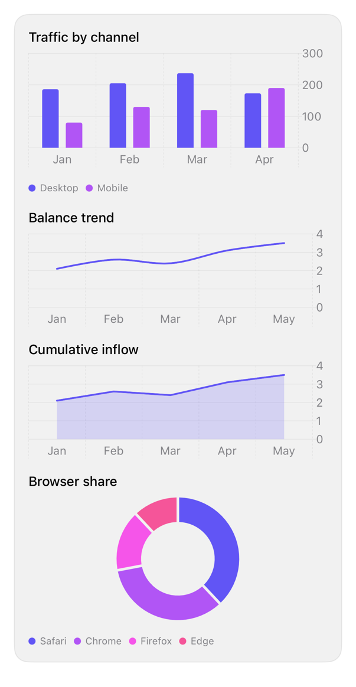

<!-- Generated by `swiftui-registry generate catalog` from Registry metadata. Do not edit by hand; edit the item document and regenerate. -->

# chart

Styles a native Swift Charts Chart to the theme: a series palette derived from the accent on the foreground style scale, theme-colored grid lines, footnote axis labels, and a bottom legend, across bar, line, area, and pie marks.



More previews: [dark](../images/items/chart-dark.png)

## Install

```sh
swiftui-registry install chart --destination Sources/YourFeature/Components
```

Point `--destination` at a folder inside the consuming target's sources, such as `Sources/YourFeature/Components`, so the copied files are members of that build target

Then add package https://github.com/mangobyte-dev/swiftui-ui-registry.git (from 0.3.0 up to the next minor version) and link product SwiftUIRegistryFoundations

```swift
// Package.swift
dependencies: [
    .package(url: "https://github.com/mangobyte-dev/swiftui-ui-registry.git", .upToNextMinor(from: "0.3.0"))
]

// In the consuming target's dependencies:
.product(name: "SwiftUIRegistryFoundations", package: "swiftui-ui-registry")
```

In an Xcode app project instead, choose File > Add Package Dependency, enter https://github.com/mangobyte-dev/swiftui-ui-registry.git with the same version rule, and add the SwiftUIRegistryFoundations product to your app target

Verify the install by building the consuming target for an iOS Simulator destination

## Usage

```swift
Chart(data) { row in
    BarMark(
        x: .value("Month", row.month),
        y: .value("Visits", row.visits)
    )
    .foregroundStyle(by: .value("Channel", row.channel))
    .position(by: .value("Channel", row.channel))
}
.registryChart()
.frame(height: 180)
```

## Details

- Kind: component
- Version: 0.1.3
- Platforms: iOS 26.0+
- Registry dependencies: none
- Accessibility contract:
  - The marks stay native Swift Charts marks, so the caller keeps the chart's accessibility: add accessibilityLabel and accessibilityValue to marks or the Chart so VoiceOver and the audio graph describe the data.
  - Series are named in the legend below the plot, so the chart does not rely on color alone; the legend reads the same palette as the plot.
  - Axis value labels use footnote text at secondary emphasis, and grid lines and ticks use the theme border, so the chrome respects Dynamic Type and the color scheme.
  - A mark colored by a category reads the accent-derived palette, whose first color is the accent and whose others rotate its hue to stay distinct; a single-series mark takes the accent explicitly with foregroundStyle(TintShapeStyle()) or a RegistryChartPalette color, since Swift Charts otherwise draws one series in its own default color.
  - The series palette follows the theme's chartPalette: accent-derived tints, a fixed spectrum, or a gray ramp; the spectrum and gray options keep the categories distinct when the accent has too little chroma to rotate, and every option follows the color scheme.
- Source: [sources/components/RegistryChart.swift](../../Registry/sources/components/RegistryChart.swift), with the `Chart` Xcode preview
