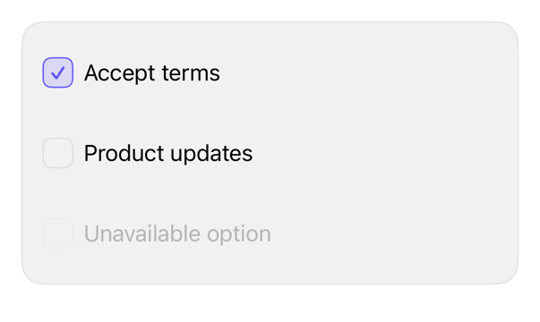

<!-- Generated by `swiftui-registry generate catalog` from Registry metadata. Do not edit by hand; edit the item document and regenerate. -->

# checkbox

Styles a native Toggle as a checkbox while preserving its binding, label, enabled state, and accessibility representation.



More previews: [dark](../images/items/checkbox-dark.png)

## Install

```sh
swiftui-registry install checkbox --destination Sources/YourFeature/Components
```

Point `--destination` at a folder inside the consuming target's sources, such as `Sources/YourFeature/Components`, so the copied files are members of that build target

Then add package https://github.com/mangobyte-dev/swiftui-ui-registry.git (from 0.3.0 up to the next minor version) and link product SwiftUIRegistryFoundations

```swift
// Package.swift
dependencies: [
    .package(url: "https://github.com/mangobyte-dev/swiftui-ui-registry.git", .upToNextMinor(from: "0.3.0"))
]

// In the consuming target's dependencies:
.product(name: "SwiftUIRegistryFoundations", package: "swiftui-ui-registry")
```

In an Xcode app project instead, choose File > Add Package Dependency, enter https://github.com/mangobyte-dev/swiftui-ui-registry.git with the same version rule, and add the SwiftUIRegistryFoundations product to your app target

Verify the install by building the consuming target for an iOS Simulator destination

## Usage

```swift
@State private var accepted = false

Toggle("Accept terms", isOn: $accepted)
    .toggleStyle(.registryCheckbox)
```

## Details

- Kind: component
- Version: 0.3.2
- Platforms: iOS 26.0+
- Registry dependencies: none
- Accessibility contract:
  - Uses a native Toggle as its accessibility representation.
  - Requires the caller's visible Toggle label and preserves the enabled state.
  - Provides a 44-point minimum row height and does not communicate selection by color alone.
  - Inherits Dynamic Type for the label, the glyph, and the box, which scales with the body text style, and inherits layout direction.
  - On iPad the row keeps SwiftUI's automatic pointer effect through hoverEffect(), because the plain button style it builds on carries none.
- Source: [sources/components/RegistryCheckboxToggleStyle.swift](../../Registry/sources/components/RegistryCheckboxToggleStyle.swift), with the `Checkbox` Xcode preview
