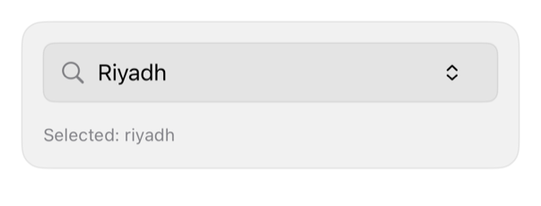

<!-- Generated by `swiftui-registry generate catalog` from Registry metadata. Do not edit by hand; edit the item document and regenerate. -->

# combobox

A searchable single-selection control with a registry search field over caller options, a filtered list below it, binding-driven selection, and a native empty state.



More previews: [dark](../images/items/combobox-dark.png)

## Install

```sh
swiftui-registry install combobox --destination Sources/YourFeature/Components
```

Point `--destination` at a folder inside the consuming target's sources, such as `Sources/YourFeature/Components`, so the copied files are members of that build target

Then add package https://github.com/mangobyte-dev/swiftui-ui-registry.git (from 0.3.0 up to the next minor version) and link product SwiftUIRegistryFoundations

```swift
// Package.swift
dependencies: [
    .package(url: "https://github.com/mangobyte-dev/swiftui-ui-registry.git", .upToNextMinor(from: "0.3.0"))
]

// In the consuming target's dependencies:
.product(name: "SwiftUIRegistryFoundations", package: "swiftui-ui-registry")
```

In an Xcode app project instead, choose File > Add Package Dependency, enter https://github.com/mangobyte-dev/swiftui-ui-registry.git with the same version rule, and add the SwiftUIRegistryFoundations product to your app target

Verify the install by building the consuming target for an iOS Simulator destination

## Usage

```swift
@State private var timezone: String? = "riyadh"

Combobox(
    selection: $timezone,
    options: [
        ComboboxOption(id: "kuwait", title: "Kuwait City", systemImage: "clock"),
        ComboboxOption(id: "riyadh", title: "Riyadh", systemImage: "clock")
    ],
    prompt: "Search time zones",
    emptyDescription: Text("Try a city name.")
)
```

## Details

- Kind: component
- Version: 0.1.1
- Platforms: iOS 26.0+
- Installs in order: [button](button.md) 0.5.2, [input-group](input-group.md) 0.2.1, [avatar](avatar.md) 0.2.1, [separator](separator.md) 0.2.1, [badge](badge.md) 0.3.2, [item](item.md) 0.2.1, [empty](empty.md) 0.1.1, [combobox](combobox.md) 0.1.1
- Accessibility contract:
  - The field carries the prompt as its explicit accessibility label and uses the search-and-filter query binding. Each option is a native Button whose label is its title. Voice Control can address an option by its title.
  - The selected option carries the isSelected trait and a checkmark. The option symbol is decorative and hidden.
  - When no option matches, the control renders a native ContentUnavailableView on the registry surface with the caller's empty title and description.
  - On focus, the list opens inline below the field and pushes content down instead of covering it, so it never hides other controls. The control does not use a popover, because at a compact iPhone width a popover becomes a full sheet, heavier than a single-select filter needs.
- Source: [sources/components/Combobox.swift](../../Registry/sources/components/Combobox.swift), with the `Combobox` Xcode preview
