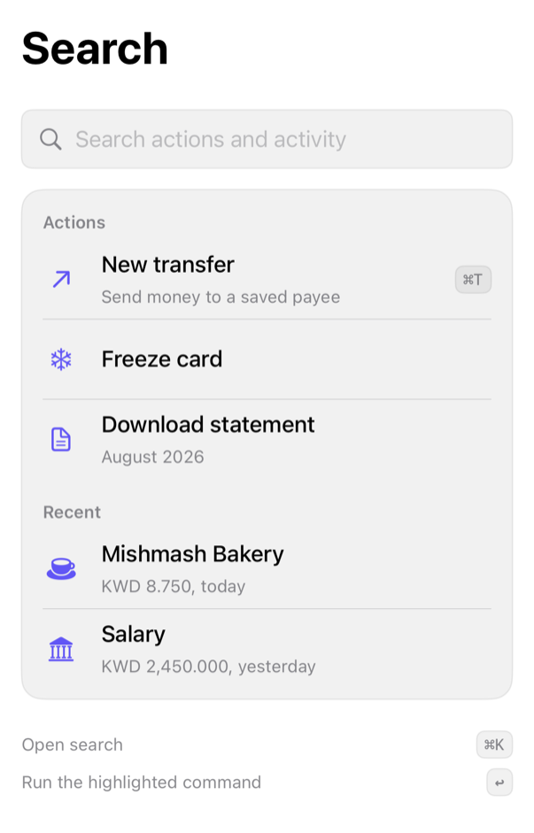

<!-- Generated by Scripts/generate_catalog.py from Registry metadata. Do not edit by hand; edit the item document and regenerate. -->

# command-search

Composes the command palette and keycap treatments into a search screen with caller-owned query, filtering, sections, and a keyboard shortcut legend.



More previews: [dark](../images/items/command-search-dark.png)

## Install

```sh
python3 Scripts/install.py command-search --destination Sources/YourFeature/Components
```

Point `--destination` at a folder inside the consuming target's sources, such as `Sources/YourFeature/Components`, so the copied files are members of that build target

Then add package https://github.com/mangobyte-dev/swiftui-ui-registry.git (from 0.1.0 up to the next minor version) and link product SwiftUIRegistryFoundations

```swift
// Package.swift
dependencies: [
    .package(url: "https://github.com/mangobyte-dev/swiftui-ui-registry.git", .upToNextMinor(from: "0.1.0"))
]

// In the consuming target's dependencies:
.product(name: "SwiftUIRegistryFoundations", package: "swiftui-ui-registry")
```

In an Xcode app project instead, choose File > Add Package Dependency, enter https://github.com/mangobyte-dev/swiftui-ui-registry.git with the same version rule, and add the SwiftUIRegistryFoundations product to your app target

Verify the install by building the consuming target for an iOS Simulator destination

## Usage

```swift
@State private var query = ""

CommandSearch(
    "Search",
    query: $query,
    prompt: "Search actions and activity",
    sections: sections,
    emptyDescription: Text("Try a payee, a card, or an action."),
    shortcuts: [
        CommandShortcutHint("Open search", keys: "⌘K", keysLabel: Text("Command K"))
    ],
    onSelect: { id in }
)
```

## Details

- Kind: block
- Version: 0.1.0
- Platforms: iOS 26.0+
- Installs in order: [button](button.md) 0.5.0, [input-group](input-group.md) 0.2.0, [separator](separator.md) 0.2.0, [badge](badge.md) 0.3.1, [item](item.md) 0.1.1, [kbd](kbd.md) 0.1.1, [empty](empty.md) 0.1.0, [command](command.md) 0.1.0, [command-search](command-search.md) 0.1.0
- Accessibility contract:
  - The search field is labeled with its prompt; commands are native Buttons with combined labels; section titles are headers.
  - No results is a native ContentUnavailableView with caller copy, never a blank surface.
  - Each legend line combines its action and spoken shortcut into one element; keycaps are hidden unless labeled.
  - Selection, filtering, and the query stay caller-owned, so the screen never triggers an action on its own.
- Source: [sources/blocks/CommandSearch.swift](../../Registry/sources/blocks/CommandSearch.swift), with the `Command Search` Xcode preview
