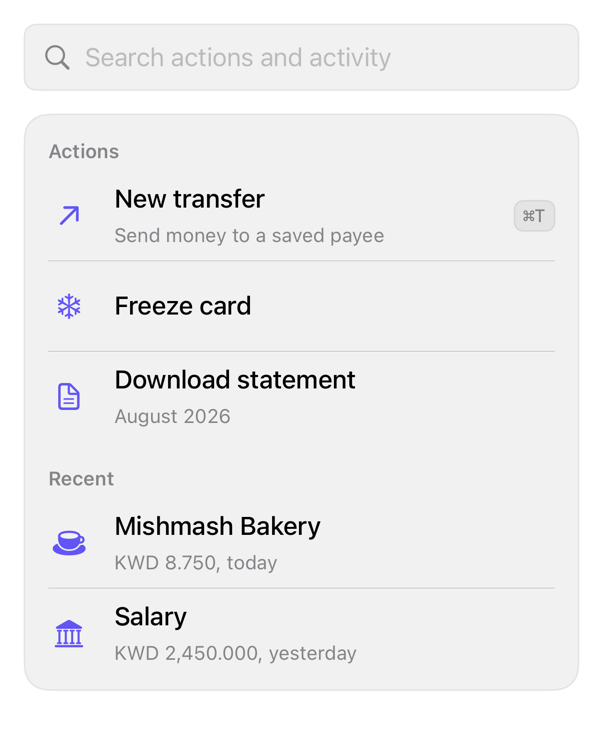

<!-- Generated by Scripts/generate_catalog.py from Registry metadata. Do not edit by hand; edit the item document and regenerate. -->

# command

Composes the registry input group, item rows, keycaps, and empty state into a search field over caller-filtered command sections.



More previews: [dark](../images/items/command-dark.png)

## Install

```sh
python3 Scripts/install.py command --destination Sources/YourFeature/Components
```

Point `--destination` at a folder inside the consuming target's sources, such as `Sources/YourFeature/Components`, so the copied files are members of that build target

Then add package https://github.com/mangobyte-dev/swiftui-ui-registry.git (from 0.1.0 up to the next minor version) and link product SwiftUIRegistryFoundations

```swift
// Package.swift
dependencies: [
    .package(url: "https://github.com/mangobyte-dev/swiftui-ui-registry.git", .upToNextMinor(from: "0.1.0"))
]

// In the consuming target's dependencies:
.product(name: "SwiftUIRegistryFoundations", package: "swiftui-ui-registry")
```

In an Xcode app project instead, choose File > Add Package Dependency, enter https://github.com/mangobyte-dev/swiftui-ui-registry.git with the same version rule, and add the SwiftUIRegistryFoundations product to your app target

Verify the install by building the consuming target for an iOS Simulator destination

## Usage

```swift
@State private var query = ""

CommandPalette(
    query: $query,
    prompt: "Search actions",
    sections: [
        CommandSection(id: "actions", title: "Actions", entries: [
            CommandEntry(id: "transfer", title: Text("New transfer"), systemImage: "arrow.up.right", shortcut: "⌘T", shortcutLabel: Text("Command T"))
        ])
    ],
    onSelect: { id in }
)
```

## Details

- Kind: component
- Version: 0.1.0
- Platforms: iOS 26.0+
- Installs in order: [button](button.md) 0.5.0, [input-group](input-group.md) 0.2.0, [separator](separator.md) 0.2.0, [badge](badge.md) 0.3.1, [item](item.md) 0.1.1, [kbd](kbd.md) 0.1.1, [empty](empty.md) 0.1.0, [command](command.md) 0.1.0
- Accessibility contract:
  - The search field carries its prompt as an explicit accessibility label and uses the search return key.
  - Section titles are headers; each command is a native Button whose label combines title and detail.
  - Shortcut keycaps speak the caller's shortcutLabel or stay hidden; the command symbol is decorative.
  - No results renders a native ContentUnavailableView with caller copy; filtering and ranking stay with the caller through the query binding.
- Source: [sources/components/CommandPalette.swift](../../Registry/sources/components/CommandPalette.swift), with the `Command Palette` Xcode preview
