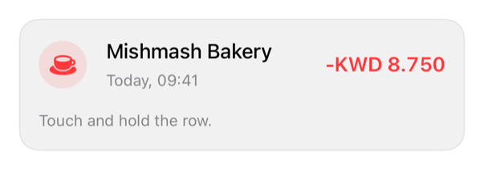

<!-- Generated by `swiftui-registry generate catalog` from Registry metadata. Do not edit by hand; edit the item document and regenerate. -->

# context-menu

Native guidance for long-press actions with .contextMenu using labeled, role-tagged buttons.



More previews: [dark](../images/items/context-menu-dark.png)

Nothing to install. Copy the snippet below

## Usage

```swift
TransactionRow(
    title: Text("Mishmash Bakery"),
    subtitle: Text("Today, 09:41"),
    amount: Text(-8.75, format: .currency(code: "KWD")),
    systemImage: "cup.and.saucer.fill"
)
.registryTone(.negative)
.contextMenu {
    Button("Add note", systemImage: "square.and.pencil") { }
    Button("Share", systemImage: "square.and.arrow.up") { }
    Divider()
    Button("Report", systemImage: "flag", role: .destructive) { }
}
```

## Why native is enough

Attach secondary actions to a row with `.contextMenu` and native `Button`s with symbols and roles. The system renders the Liquid Glass menu, the preview, and haptics; keep the same actions reachable elsewhere because a long press is not discoverable on its own.

## Details

- Kind: recipe
- Version: 0.1.1
- Platforms: iOS 26.0+
- Accessibility contract:
  - Context menus are exposed through the VoiceOver actions rotor.
  - Destructive roles render in the system's destructive style without custom color.
  - Actions in a context menu must also exist in a visible place, such as a detail screen.
