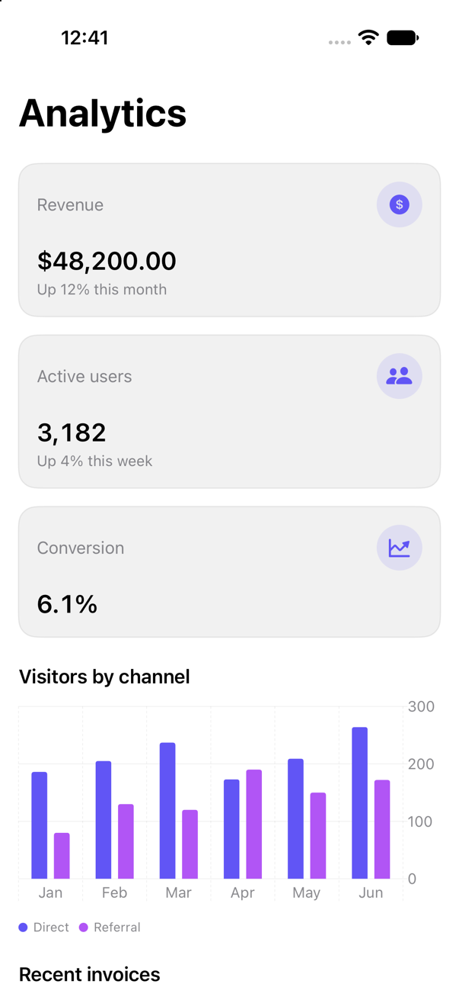

<!-- Generated by `swiftui-registry generate catalog` from Registry metadata. Do not edit by hand; edit the item document and regenerate. -->

# dashboard

Composes metric cards, a themed Swift Charts bar chart, and a data table into an analytics dashboard with caller-owned values and optional row selection.



More previews: [dark](../images/items/dashboard-dark.png)

## Install

```sh
swiftui-registry install dashboard --destination Sources/YourFeature/Components
```

Point `--destination` at a folder inside the consuming target's sources, such as `Sources/YourFeature/Components`, so the copied files are members of that build target

Then add package https://github.com/mangobyte-dev/swiftui-ui-registry.git (from 0.2.1 up to the next minor version) and link product SwiftUIRegistryFoundations

```swift
// Package.swift
dependencies: [
    .package(url: "https://github.com/mangobyte-dev/swiftui-ui-registry.git", .upToNextMinor(from: "0.2.1"))
]

// In the consuming target's dependencies:
.product(name: "SwiftUIRegistryFoundations", package: "swiftui-ui-registry")
```

In an Xcode app project instead, choose File > Add Package Dependency, enter https://github.com/mangobyte-dev/swiftui-ui-registry.git with the same version rule, and add the SwiftUIRegistryFoundations product to your app target

Verify the install by building the consuming target for an iOS Simulator destination

## Usage

```swift
Dashboard(
    "Analytics",
    metrics: [
        DashboardMetric(
            title: "Revenue",
            value: Text(48_200, format: .currency(code: "USD")),
            detail: Text("Up 12% this month"),
            systemImage: "dollarsign.circle.fill"
        )
    ],
    chartTitle: "Visitors by channel",
    points: [
        DashboardSeriesPoint(id: "jan-direct", category: "Jan", series: "Direct", value: 186)
    ],
    tableTitle: "Recent invoices",
    rows: [
        DashboardRow(
            id: "1041",
            title: Text("Invoice 1041"),
            detail: Text("Northwind Trading"),
            status: Text("Paid"),
            amount: Text(1_240, format: .currency(code: "USD"))
        )
    ],
    onSelect: { id in }
)
```

## Details

- Kind: block
- Version: 0.1.1
- Platforms: iOS 26.0+
- Installs in order: [metric-card](metric-card.md) 0.2.2, [chart](chart.md) 0.1.3, [separator](separator.md) 0.2.1, [table](table.md) 0.1.1, [dashboard](dashboard.md) 0.1.1
- Accessibility contract:
  - The screen title and both section titles (chart and table) carry the header accessibility trait, so VoiceOver users can move between sections by heading.
  - The metric tiles combine their title, value, and detail into one VoiceOver element and treat the SF Symbol as decorative (from metric-card), and lay out as a row or a column through ViewThatFits so they follow Dynamic Type and the available width.
  - When onSelect is provided each invoice title is a native Button with the plain button style, so selection stays at the call site; the button takes the row title as its accessibility and Voice Control input label, and with no action the table stays a plain non-interactive grid.
  - The chart keeps native Swift Charts marks colored and positioned by series, with the series named in the legend below the plot (from chart), so it does not rely on color alone; the caller can add accessibilityLabel and accessibilityValue to the marks for the audio graph.
  - The table combines each row into one accessibility element and the header row carries the header trait, while numeric amounts use monospaced digits and hug the trailing edge (from table).
  - Uses the semantic spacing tokens and leading alignment throughout, so the layout follows Dynamic Type and right-to-left direction.
- Source: [sources/blocks/Dashboard.swift](../../Registry/sources/blocks/Dashboard.swift), with the `Dashboard` Xcode preview
