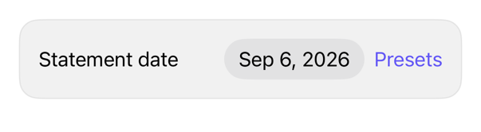

<!-- Generated by `swiftui-registry generate catalog` from Registry metadata. Do not edit by hand; edit the item document and regenerate. -->

# date-picker

Compact DatePicker, closed range, presets Menu.



More previews: [dark](../images/items/date-picker-dark.png)

Nothing to install. Copy the snippet below

## Usage

```swift
@State private var date = Date.now

DatePicker("Statement date", selection: $date, in: range, displayedComponents: .date)
    .datePickerStyle(.compact)

Menu("Presets") {
    Button("Today") { date = .now }
    Button("Tomorrow") { date = .now.addingTimeInterval(60 * 60 * 24) }
    Button("Next week") { date = .now.addingTimeInterval(60 * 60 * 24 * 7) }
}
.accessibilityLabel("Date presets")
```

## Why native is enough

`DatePicker` `.compact` + `ClosedRange<Date>` restricts pickable dates. `Menu` presets write binding. `calendar`: graphical month view. Compact = single tap target; no wrapper. Empty/reversed range traps at one date.

## Details

- Kind: recipe
- Version: 0.1.0
- Platforms: iOS 26.0+
- Accessibility contract:
  - DatePicker: title = accessibility label; reads date.
  - Label presets Menu; clear without visible glyph.
