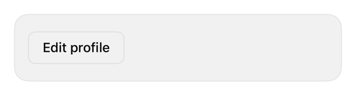

<!-- Generated by `swiftui-registry generate catalog` from Registry metadata. Do not edit by hand; edit the item document and regenerate. -->

# dialog

Native guidance for modal content with .sheet, leaving detents, drag dismissal, and focus to the system.



More previews: [dark](../images/items/dialog-dark.png)

Nothing to install. Copy the snippet below

## Usage

```swift
@State private var isEditing = false

Button("Edit profile") { isEditing = true }
    .sheet(isPresented: $isEditing) {
        NavigationStack {
            ProfileEditor()
                .navigationTitle("Edit profile")
                .toolbar {
                    ToolbarItem(placement: .confirmationAction) {
                        Button("Done") { isEditing = false }
                    }
                }
        }
    }
```

## Why native is enough

Present editing or detail content with the native `.sheet` modifier wrapped in a `NavigationStack` so the title and confirmation action land in system chrome. Liquid Glass, the grabber, swipe-to-dismiss, and keyboard avoidance come from the system; the registry adds no wrapper.

## Details

- Kind: recipe
- Version: 0.1.0
- Platforms: iOS 26.0+
- Accessibility contract:
  - Sheets present as modal to VoiceOver and support swipe-to-dismiss and the escape gesture.
  - Toolbar placements give Done and Cancel their system position and semantics.
  - Content inside the sheet uses registry items like any other screen.
