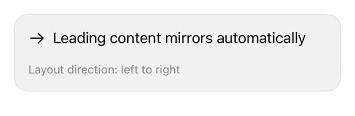

<!-- Generated by `swiftui-registry generate catalog` from Registry metadata. Do not edit by hand; edit the item document and regenerate. -->

# direction

layoutDirection guidance.



More previews: [dark](../images/items/direction-dark.png)

Nothing to install. Copy the snippet below

## Usage

```swift
@Environment(\.layoutDirection) private var layoutDirection

HStack {
    Image(systemName: "person.crop.circle")
        .accessibilityHidden(true)
    Text("Account")
    Spacer()
    Image(systemName: "chevron.forward")
        .accessibilityHidden(true)
}
```

## Why native is enough

`layoutDirection`: leading/trailing, not left/right; no replacement. `chevron.forward` mirrors; preview via `.environment`, `.rightToLeft`.

## Details

- Kind: recipe
- Version: 0.3.0
- Platforms: iOS 26.0+
- Accessibility contract:
  - Semantic reading order, leading/trailing alignment.
  - Symbols: decorative.
  - SwiftUI environment, not duplicated state.
