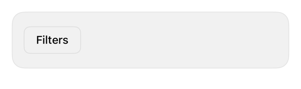

<!-- Generated by `swiftui-registry generate catalog` from Registry metadata. Do not edit by hand; edit the item document and regenerate. -->

# drawer

Drawer guidance.



More previews: [dark](../images/items/drawer-dark.png)

Nothing to install. Copy the snippet below

## Usage

```swift
@State private var isShowingFilters = false

Button("Filters") { isShowingFilters = true }
    .sheet(isPresented: $isShowingFilters) {
        FilterOptions()
            .presentationDetents([.medium, .large])
            .presentationDragIndicator(.visible)
    }
```

## Why native is enough

Drawer = sheet + `.presentationDetents`, drag indicator; system resize/dim/dismiss. MUST NOT fake via offset-overlay.

## Details

- Kind: recipe
- Version: 0.1.0
- Platforms: iOS 26.0+
- Accessibility contract:
  - Detents: announced, VoiceOver-adjustable.
  - Drag indicator visible; add button dismissal.
  - Content MUST reach medium detent or scroll.
