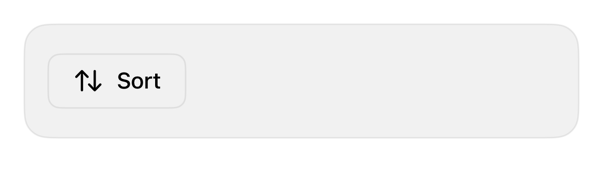

<!-- Generated by `swiftui-registry generate catalog` from Registry metadata. Do not edit by hand; edit the item document and regenerate. -->

# dropdown-menu

Native guidance for a Menu trigger with labeled actions, sections, and a picker inside the menu.



More previews: [dark](../images/items/dropdown-menu-dark.png)

Nothing to install. Copy the snippet below

## Usage

```swift
@State private var sort = "recent"

Menu("Sort", systemImage: "arrow.up.arrow.down") {
    Picker("Sort by", selection: $sort) {
        Text("Most recent").tag("recent")
        Text("Amount").tag("amount")
    }
    Divider()
    Button("Export", systemImage: "square.and.arrow.up") { }
}
.buttonStyle(.registryOutline)
```

## Why native is enough

Use a native `Menu` for dropdown actions; a `Picker` inside it becomes a checkmarked selection group and a `Divider` starts a section. The trigger takes any registry button style; the menu itself stays system-owned.

## Details

- Kind: recipe
- Version: 0.1.0
- Platforms: iOS 26.0+
- Accessibility contract:
  - The menu trigger keeps a visible text label; a symbol-only trigger needs an accessibility label.
  - Picker selection inside a menu announces the checked state.
  - Menu presentation, dismissal, and Liquid Glass are system behavior.
