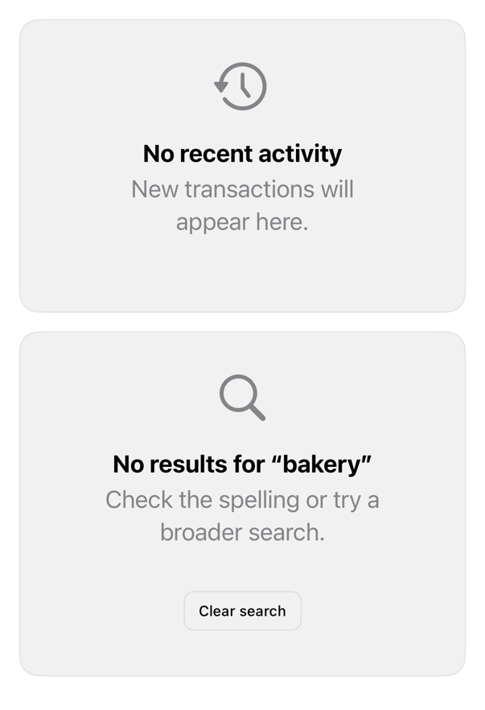

<!-- Generated by `swiftui-registry generate catalog` from Registry metadata. Do not edit by hand; edit the item document and regenerate. -->

# empty

Places ContentUnavailableView on registry surface, where rows appear.



More previews: [dark](../images/items/empty-dark.png)

## Install

```sh
swiftui-registry install empty --destination Sources/YourFeature/Components
```

Point `--destination` at a folder inside the consuming target's sources, such as `Sources/YourFeature/Components`, so the copied files are members of that build target

Then add package https://github.com/mangobyte-dev/swiftui-ui-registry.git (from 0.3.0 up to the next minor version) and link product SwiftUIRegistryFoundations

```swift
// Package.swift
dependencies: [
    .package(url: "https://github.com/mangobyte-dev/swiftui-ui-registry.git", .upToNextMinor(from: "0.3.0"))
]

// In the consuming target's dependencies:
.product(name: "SwiftUIRegistryFoundations", package: "swiftui-ui-registry")
```

In an Xcode app project instead, choose File > Add Package Dependency, enter https://github.com/mangobyte-dev/swiftui-ui-registry.git with the same version rule, and add the SwiftUIRegistryFoundations product to your app target

Verify the install by building the consuming target for an iOS Simulator destination

## Usage

```swift
ContentUnavailableView(
    "No recent activity",
    systemImage: "clock.arrow.circlepath",
    description: Text("New transactions will appear here.")
)
.registryEmptyState()
```

## Details

- Kind: component
- Version: 0.1.1
- Platforms: iOS 26.0+
- Registry dependencies: none
- Accessibility contract:
  - Keeps ContentUnavailableView semantics (title, description, symbol, actions).
  - Adds surface, padding, border; not interactive.
  - Inherits Dynamic Type, color scheme, direction.
- Source: [sources/components/RegistryEmptyStateModifier.swift](../../Registry/sources/components/RegistryEmptyStateModifier.swift), with the `Empty State` Xcode preview
