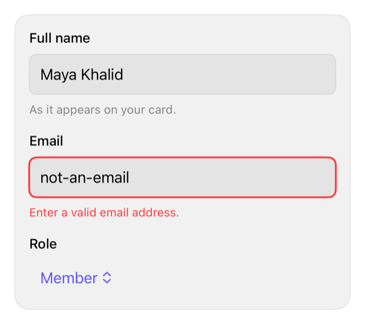

<!-- Generated by `swiftui-registry generate catalog` from Registry metadata. Do not edit by hand; edit the item document and regenerate. -->

# field

Composes a labeled form field around a native control with an optional description and an error message that drives the content's invalid state.



More previews: [dark](../images/items/field-dark.png)

## Install

```sh
swiftui-registry install field --destination Sources/YourFeature/Components
```

Point `--destination` at a folder inside the consuming target's sources, such as `Sources/YourFeature/Components`, so the copied files are members of that build target

Then add package https://github.com/mangobyte-dev/swiftui-ui-registry.git (from 0.1.0 up to the next minor version) and link product SwiftUIRegistryFoundations

```swift
// Package.swift
dependencies: [
    .package(url: "https://github.com/mangobyte-dev/swiftui-ui-registry.git", .upToNextMinor(from: "0.1.0"))
]

// In the consuming target's dependencies:
.product(name: "SwiftUIRegistryFoundations", package: "swiftui-ui-registry")
```

In an Xcode app project instead, choose File > Add Package Dependency, enter https://github.com/mangobyte-dev/swiftui-ui-registry.git with the same version rule, and add the SwiftUIRegistryFoundations product to your app target

Verify the install by building the consuming target for an iOS Simulator destination

## Usage

```swift
@State private var email = ""

FieldGroup {
    Field("Full name", description: "As it appears on your card.") { _ in
        TextField("Full name", text: $name)
            .textFieldStyle(.registryInput)
            .accessibilityLabel("Full name")
    }
    Field("Email", error: emailError) { isInvalid in
        TextField("you@example.com", text: $email)
            .textFieldStyle(RegistryInputStyle(isInvalid: isInvalid))
            .accessibilityLabel("Email")
    }
}
```

## Details

- Kind: component
- Version: 0.1.0
- Platforms: iOS 26.0+
- Installs in order: [input](input.md) 0.5.0, [field](field.md) 0.1.0
- Accessibility contract:
  - The content builder receives the invalid state; the caller applies it to a control that has one, such as RegistryInputStyle(isInvalid:), so the field never fakes an invalid treatment on a control without one.
  - A separate label view is not associated with the control automatically, so give the control an explicit accessibilityLabel matching the visible label.
  - When present the error, otherwise the description, becomes the content's accessibility hint, so a focused control re-reads the most urgent message; a new error is also posted as an announcement.
  - Uses system text styles and the semantic spacing tokens; the label, description, and error all wrap rather than truncate.
- Source: [sources/components/Field.swift](../../Registry/sources/components/Field.swift), with the `Field` Xcode preview
