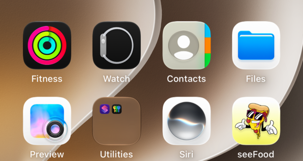

<!-- Generated by Scripts/generate_catalog.py from Registry metadata. Do not edit by hand; edit the item document and regenerate. -->

# input-group

Wraps a native text field with registry input chrome and caller-provided leading and trailing accessories, such as a search symbol and a clear button.



More previews: [dark](../images/items/input-group-dark.png)

## Install

```sh
python3 Scripts/install.py input-group --destination Sources/YourFeature/Components
```

Point `--destination` at a folder inside the consuming target's sources, such as `Sources/YourFeature/Components`, so the copied files are members of that build target

Then add package https://github.com/mangobyte-dev/swiftui-ui-registry.git (from 0.1.0 up to the next minor version) and link product SwiftUIRegistryFoundations

```swift
// Package.swift
dependencies: [
    .package(url: "https://github.com/mangobyte-dev/swiftui-ui-registry.git", .upToNextMinor(from: "0.1.0"))
]

// In the consuming target's dependencies:
.product(name: "SwiftUIRegistryFoundations", package: "swiftui-ui-registry")
```

In an Xcode app project instead, choose File > Add Package Dependency, enter https://github.com/mangobyte-dev/swiftui-ui-registry.git with the same version rule, and add the SwiftUIRegistryFoundations product to your app target

Verify the install by building the consuming target for an iOS Simulator destination

## Usage

```swift
@State private var query = ""

InputGroup {
    Image(systemName: "magnifyingglass")
        .accessibilityHidden(true)
} content: {
    TextField("Search transactions", text: $query)
        .accessibilityLabel("Search transactions")
} trailing: {
    if !query.isEmpty {
        Button("Clear", systemImage: "xmark.circle.fill") { query = "" }
            .labelStyle(.iconOnly)
            .buttonStyle(.registryGhost)
            .controlSize(.small)
    }
}
```

## Details

- Kind: component
- Version: 0.1.0
- Platforms: iOS 26.0+
- Installs in order: [button](button.md) 0.4.0, [input-group](input-group.md) 0.1.0
- Accessibility contract:
  - The field stays a native TextField or SecureField; give it an explicit accessibilityLabel because the title is placeholder text only.
  - Leading accessories are decorative by default and should be hidden; a trailing button keeps its own label and 44 point hit area.
  - Focus draws the accent ring and the invalid state draws the negative border at the emphasized width, never color alone because the caller pairs it with a message.
  - Keeps the 44 point minimum height and applies the shared disabled opacity.
- Source: [sources/components/InputGroup.swift](../../Registry/sources/components/InputGroup.swift), with the `Input Group` Xcode preview
