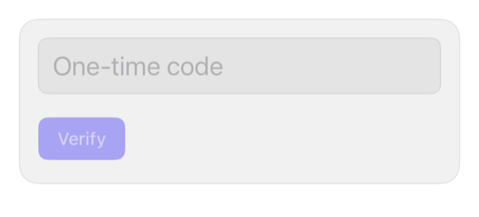

<!-- Generated by `swiftui-registry generate catalog` from Registry metadata. Do not edit by hand; edit the item document and regenerate. -->

# input-otp

One-time-code TextField, not a boxed control.



More previews: [dark](../images/items/input-otp-dark.png)

Nothing to install. Copy the snippet below

## Usage

```swift
@State private var code = ""

TextField("One-time code", text: $code)
    .textContentType(.oneTimeCode)
    .keyboardType(.numberPad)
    .textFieldStyle(.registryInput)
    .font(.title2.monospacedDigit())
    .accessibilityLabel("Verification code")
    .onChange(of: code) { _, newValue in
        code = String(newValue.filter(\.isNumber).prefix(6))
    }

Button("Verify") { }
    .buttonStyle(.registry)
    .disabled(code.count < 6)
```

## Why native is enough

`TextField` + `.textContentType(.oneTimeCode)`: offers Messages/Mail code above keyboard; `.keyboardType(.numberPad)`: numeric. Six-box imitates, loses autofill. `onChange` caps 6 digits. No type: no offer.

## Details

- Kind: recipe
- Version: 0.1.0
- Platforms: iOS 26.0+
- Accessibility contract:
  - Needs explicit label; title shows only as placeholder.
  - Monospaced-digit font: legible at large Dynamic Type.
