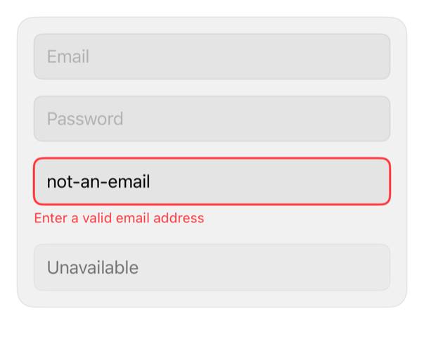

<!-- Generated by `swiftui-registry generate catalog` from Registry metadata. Do not edit by hand; edit the item document and regenerate. -->

# input

Styles native TextField and SecureField controls with semantic fill, focus, disabled, and invalid treatments.



More previews: [dark](../images/items/input-dark.png)

## Install

```sh
swiftui-registry install input --destination Sources/YourFeature/Components
```

Point `--destination` at a folder inside the consuming target's sources, such as `Sources/YourFeature/Components`, so the copied files are members of that build target

Then add package https://github.com/mangobyte-dev/swiftui-ui-registry.git (from 0.1.0 up to the next minor version) and link product SwiftUIRegistryFoundations

```swift
// Package.swift
dependencies: [
    .package(url: "https://github.com/mangobyte-dev/swiftui-ui-registry.git", .upToNextMinor(from: "0.1.0"))
]

// In the consuming target's dependencies:
.product(name: "SwiftUIRegistryFoundations", package: "swiftui-ui-registry")
```

In an Xcode app project instead, choose File > Add Package Dependency, enter https://github.com/mangobyte-dev/swiftui-ui-registry.git with the same version rule, and add the SwiftUIRegistryFoundations product to your app target

Verify the install by building the consuming target for an iOS Simulator destination

## Usage

```swift
@State private var email = ""
@State private var password = ""

// The title is placeholder text to VoiceOver; the explicit label names
// the field once it holds text.
TextField("Email", text: $email)
    .textFieldStyle(.registryInput)
    .accessibilityLabel("Email")

SecureField("Password", text: $password)
    .textFieldStyle(.registryInput)
    .accessibilityLabel("Password")

TextField("Email", text: $email)
    .textFieldStyle(RegistryInputStyle(isInvalid: true))
    .accessibilityLabel("Email")
    .accessibilityHint("Enter a valid email address")
```

## Details

- Kind: component
- Version: 0.5.0
- Platforms: iOS 26.0+
- Registry dependencies: none
- Accessibility contract:
  - Give every field an explicit accessibilityLabel matching its visible title. Measured on iOS 27: neither the title initializer nor the label-plus-prompt initializer exposes a label (the title is the placeholder value only), so a field with typed content is otherwise unnamed to VoiceOver; the Showcase demo audit rejects an unlabeled field.
  - Preserves native TextField and SecureField editing, keyboard, and autofill behavior.
  - Focus draws the accent ring at the emphasized width; the invalid state draws the negative border at the same width and wins over focus, so the caller pairs it with a message.
  - Requires callers to provide visible validation copy and an accessibility hint for invalid input.
  - Inherits Dynamic Type, layout direction, and enabled state.
  - Keeps the 44 point minimum height, so an empty field is a full tap target at every text size.
- Source: [sources/components/RegistryInputStyle.swift](../../Registry/sources/components/RegistryInputStyle.swift), with the `Input States` Xcode preview
