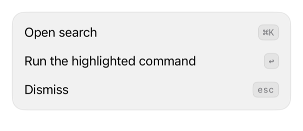

<!-- Generated by `swiftui-registry generate catalog` from Registry metadata. Do not edit by hand; edit the item document and regenerate. -->

# kbd

Draws text as a keycap for keyboard shortcut hints, hidden from accessibility unless a spoken label is supplied.



More previews: [dark](../images/items/kbd-dark.png)

## Install

```sh
swiftui-registry install kbd --destination Sources/YourFeature/Components
```

Point `--destination` at a folder inside the consuming target's sources, such as `Sources/YourFeature/Components`, so the copied files are members of that build target

Then add package https://github.com/mangobyte-dev/swiftui-ui-registry.git (from 0.1.0 up to the next minor version) and link product SwiftUIRegistryFoundations

```swift
// Package.swift
dependencies: [
    .package(url: "https://github.com/mangobyte-dev/swiftui-ui-registry.git", .upToNextMinor(from: "0.1.0"))
]

// In the consuming target's dependencies:
.product(name: "SwiftUIRegistryFoundations", package: "swiftui-ui-registry")
```

In an Xcode app project instead, choose File > Add Package Dependency, enter https://github.com/mangobyte-dev/swiftui-ui-registry.git with the same version rule, and add the SwiftUIRegistryFoundations product to your app target

Verify the install by building the consuming target for an iOS Simulator destination

## Usage

```swift
Text(verbatim: "⌘K")
    .registryKeycap(accessibilityLabel: Text("Command K"))

Text(verbatim: "esc")
    .registryKeycap()
```

## Details

- Kind: component
- Version: 0.1.1
- Platforms: iOS 26.0+
- Registry dependencies: none
- Accessibility contract:
  - Hidden from accessibility by default because symbols such as the command glyph read poorly; pass accessibilityLabel to speak the shortcut.
  - One line at its intrinsic size; a keycap never wraps.
  - Uses the compact radius, surface, border, and spacing tokens so it matches badges.
- Source: [sources/components/RegistryKeycapModifier.swift](../../Registry/sources/components/RegistryKeycapModifier.swift), with the `Keycap` Xcode preview
