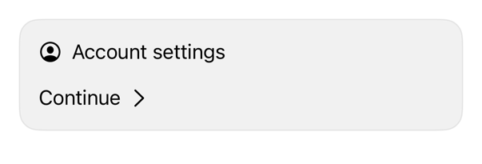

<!-- Generated by `swiftui-registry generate catalog` from Registry metadata. Do not edit by hand; edit the item document and regenerate. -->

# label

Controls native Label icon placement with semantic spacing and treats the icon as decorative for accessibility.



More previews: [dark](../images/items/label-dark.png)

## Install

```sh
swiftui-registry install label --destination Sources/YourFeature/Components
```

Point `--destination` at a folder inside the consuming target's sources, such as `Sources/YourFeature/Components`, so the copied files are members of that build target

Then add package https://github.com/mangobyte-dev/swiftui-ui-registry.git (from 0.3.0 up to the next minor version) and link product SwiftUIRegistryFoundations

```swift
// Package.swift
dependencies: [
    .package(url: "https://github.com/mangobyte-dev/swiftui-ui-registry.git", .upToNextMinor(from: "0.3.0"))
]

// In the consuming target's dependencies:
.product(name: "SwiftUIRegistryFoundations", package: "swiftui-ui-registry")
```

In an Xcode app project instead, choose File > Add Package Dependency, enter https://github.com/mangobyte-dev/swiftui-ui-registry.git with the same version rule, and add the SwiftUIRegistryFoundations product to your app target

Verify the install by building the consuming target for an iOS Simulator destination

## Usage

```swift
Label("Account settings", systemImage: "person.crop.circle")
    .labelStyle(.registry)

Label("Continue", systemImage: "chevron.forward")
    .labelStyle(.registryTrailingIcon)
```

## Details

- Kind: component
- Version: 0.2.1
- Platforms: iOS 26.0+
- Registry dependencies: none
- Accessibility contract:
  - Keeps the native Label title as the accessible content.
  - Treats the paired icon as decorative to avoid repeating the title.
  - Uses semantic order so leading and trailing placements mirror in right-to-left layouts.
  - Inherits the caller's text style and Dynamic Type behavior.
- Source: [sources/components/RegistryLabelStyle.swift](../../Registry/sources/components/RegistryLabelStyle.swift), with the `Label` Xcode preview
