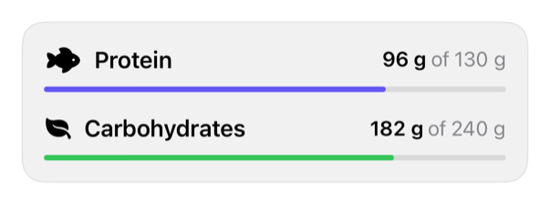

<!-- Generated by Scripts/generate_catalog.py from Registry metadata. Do not edit by hand; edit the item document and regenerate. -->

# macro-progress

Displays prepared nutrition progress with a native progress view and adaptive value layout.



More previews: [dark](../images/items/macro-progress-dark.png)

## Install

```sh
python3 Scripts/install.py macro-progress --destination Sources/YourFeature/Components
```

Point `--destination` at a folder inside the consuming target's sources, such as `Sources/YourFeature/Components`, so the copied files are members of that build target

Then add package https://github.com/mangobyte-dev/swiftui-ui-registry.git (from 0.1.0 up to the next minor version) and link product SwiftUIRegistryFoundations

```swift
// Package.swift
dependencies: [
    .package(url: "https://github.com/mangobyte-dev/swiftui-ui-registry.git", .upToNextMinor(from: "0.1.0"))
]

// In the consuming target's dependencies:
.product(name: "SwiftUIRegistryFoundations", package: "swiftui-ui-registry")
```

In an Xcode app project instead, choose File > Add Package Dependency, enter https://github.com/mangobyte-dev/swiftui-ui-registry.git with the same version rule, and add the SwiftUIRegistryFoundations product to your app target

Verify the install by building the consuming target for an iOS Simulator destination

## Usage

```swift
MacroProgress(
    "Protein",
    value: Text("96 g"),
    target: Text("130 g"),
    progress: 96.0 / 130.0,
    systemImage: "fish.fill",
    tint: .indigo
)
```

## Details

- Kind: component
- Version: 0.2.0
- Platforms: iOS 26.0+
- Registry dependencies: none
- Accessibility contract:
  - Uses native ProgressView semantics.
  - Uses ViewThatFits to move prepared values below the label when horizontal space is constrained.
  - Combines the label and prepared values without relying on tint to communicate meaning.
- Source: [sources/components/MacroProgress.swift](../../Registry/sources/components/MacroProgress.swift), with the `Macro Progress` Xcode preview
