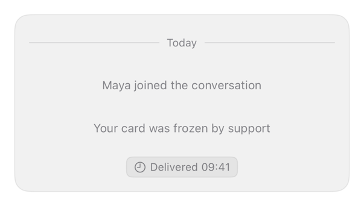

<!-- Generated by `swiftui-registry generate catalog` from Registry metadata. Do not edit by hand; edit the item document and regenerate. -->

# marker

Treats a Text as an inline conversation marker with note, status, and separator variants for system lines, delivery pills, and labelled date rules.



More previews: [dark](../images/items/marker-dark.png)

## Install

```sh
swiftui-registry install marker --destination Sources/YourFeature/Components
```

Point `--destination` at a folder inside the consuming target's sources, such as `Sources/YourFeature/Components`, so the copied files are members of that build target

Then add package https://github.com/mangobyte-dev/swiftui-ui-registry.git (from 0.1.0 up to the next minor version) and link product SwiftUIRegistryFoundations

```swift
// Package.swift
dependencies: [
    .package(url: "https://github.com/mangobyte-dev/swiftui-ui-registry.git", .upToNextMinor(from: "0.1.0"))
]

// In the consuming target's dependencies:
.product(name: "SwiftUIRegistryFoundations", package: "swiftui-ui-registry")
```

In an Xcode app project instead, choose File > Add Package Dependency, enter https://github.com/mangobyte-dev/swiftui-ui-registry.git with the same version rule, and add the SwiftUIRegistryFoundations product to your app target

Verify the install by building the consuming target for an iOS Simulator destination

## Usage

```swift
Text("Today")
    .registryMarker(.separator)

Text("Maya joined the conversation")
    .registryMarker()

Text("Delivered 09:41")
    .registryMarker(.status)
```

## Details

- Kind: component
- Version: 0.1.0
- Platforms: iOS 26.0+
- Installs in order: [separator](separator.md) 0.2.0, [marker](marker.md) 0.1.0
- Accessibility contract:
  - The status variant hides its leading clock symbol from VoiceOver, so only the caller's words are spoken.
  - The separator variant draws its two rules as decoration, so assistive technology reads only the label between them.
  - Every variant keeps its text on one line and scales it down before it wraps, so a marker never breaks across lines.
  - Uses system text styles, so a marker grows with Dynamic Type and follows the caller's layout direction.
- Source: [sources/components/RegistryMarkerModifier.swift](../../Registry/sources/components/RegistryMarkerModifier.swift), with the `Marker` Xcode preview
