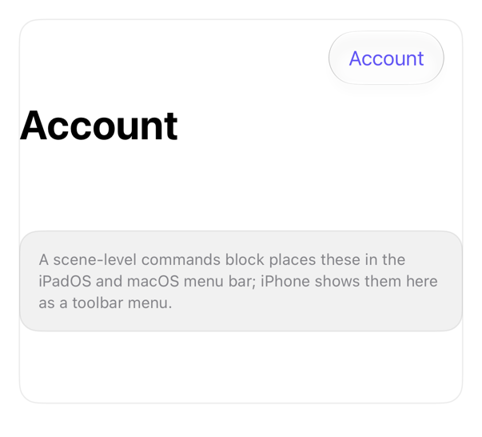

<!-- Generated by `swiftui-registry generate catalog` from Registry metadata. Do not edit by hand; edit the item document and regenerate. -->

# menubar

Native guidance for scene-level commands with CommandMenu, which iPadOS and macOS place in the menu bar.



More previews: [dark](../images/items/menubar-dark.png)

Nothing to install. Copy the snippet below

## Usage

```swift
WindowGroup {
    RootView()
}
.commands {
    CommandMenu("Account") {
        Button("Sign Out") { }
            .keyboardShortcut("q", modifiers: [.command, .shift])
    }
}
```

## Why native is enough

Declare a `commands` block on the `WindowGroup` scene and add a `CommandMenu` with keyboard shortcuts; iPadOS and macOS place it in the system menu bar. A desktop menu bar is never drawn on iPhone, so the on-screen iPhone form of the same actions is a toolbar `Menu`. Commands are a `Scene` modifier and cannot be declared inside a view. Watch the placement: put the `commands` block on the scene, not a view, or it will not compile.

## Details

- Kind: recipe
- Version: 0.1.0
- Platforms: iOS 26.0+
- Accessibility contract:
  - Menu bar commands carry keyboard shortcuts and are reachable by full keyboard access on iPadOS and macOS.
  - The iPhone toolbar Menu is a labeled control that lists the same buttons.
