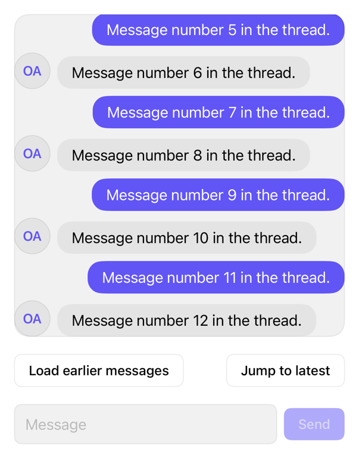

<!-- Generated by `swiftui-registry generate catalog` from Registry metadata. Do not edit by hand; edit the item document and regenerate. -->

# message-scroller

Chat ScrollView: newest-turn open, follows streamed replies, holds scrolled-up reader, requests history at top.



More previews: [dark](../images/items/message-scroller-dark.png)

## Install

```sh
swiftui-registry install message-scroller --destination Sources/YourFeature/Components
```

Point `--destination` at a folder inside the consuming target's sources, such as `Sources/YourFeature/Components`, so the copied files are members of that build target

Then add package https://github.com/mangobyte-dev/swiftui-ui-registry.git (from 0.3.0 up to the next minor version) and link product SwiftUIRegistryFoundations

```swift
// Package.swift
dependencies: [
    .package(url: "https://github.com/mangobyte-dev/swiftui-ui-registry.git", .upToNextMinor(from: "0.3.0"))
]

// In the consuming target's dependencies:
.product(name: "SwiftUIRegistryFoundations", package: "swiftui-ui-registry")
```

In an Xcode app project instead, choose File > Add Package Dependency, enter https://github.com/mangobyte-dev/swiftui-ui-registry.git with the same version rule, and add the SwiftUIRegistryFoundations product to your app target

Verify the install by building the consuming target for an iOS Simulator destination

## Usage

```swift
MessageScroller(position: $position, isFollowing: $isFollowing) {
    ForEach(messages) { message in
        MessageRow {
            Text(message.text)
        }
        .registryVariant(message.isMine ? .outgoing : .incoming)
        .id(message.id)
    }
}
```

## Details

- Kind: component
- Version: 0.1.1
- Platforms: iOS 26.0+
- Installs in order: [avatar](avatar.md) 0.2.1, [bubble](bubble.md) 0.1.1, [message](message.md) 0.1.1, [message-scroller](message-scroller.md) 0.1.1
- Accessibility contract:
  - Native ScrollView; VoiceOver, three-finger scroll work; hides nothing.
  - Pinned to newest turn (bottom anchor).
  - Pinned within 8 points of bottom; else holds on new turns.
  - 40 points from top: onReachTop fires once per height; prepend re-arms.
  - Row order = caller order. Give rows .id for scrollPosition.
- Source: [sources/components/MessageScroller.swift](../../Registry/sources/components/MessageScroller.swift), with the `Message Scroller` Xcode preview
