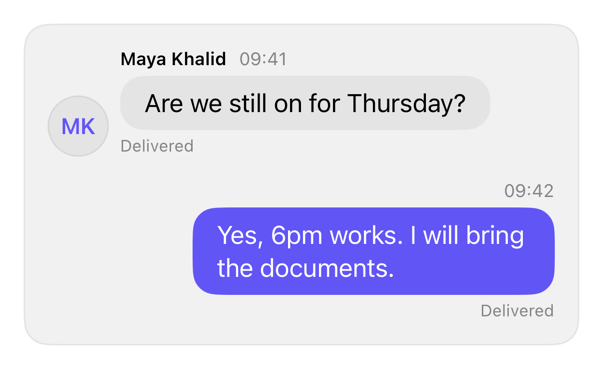

<!-- Generated by `swiftui-registry generate catalog` from Registry metadata. Do not edit by hand; edit the item document and regenerate. -->

# message

Composes one conversation turn with an optional author and timestamp header, the content in a bubble, an optional status line, and side-based alignment.



More previews: [dark](../images/items/message-dark.png)

## Install

```sh
swiftui-registry install message --destination Sources/YourFeature/Components
```

Point `--destination` at a folder inside the consuming target's sources, such as `Sources/YourFeature/Components`, so the copied files are members of that build target

Then add package https://github.com/mangobyte-dev/swiftui-ui-registry.git (from 0.1.0 up to the next minor version) and link product SwiftUIRegistryFoundations

```swift
// Package.swift
dependencies: [
    .package(url: "https://github.com/mangobyte-dev/swiftui-ui-registry.git", .upToNextMinor(from: "0.1.0"))
]

// In the consuming target's dependencies:
.product(name: "SwiftUIRegistryFoundations", package: "swiftui-ui-registry")
```

In an Xcode app project instead, choose File > Add Package Dependency, enter https://github.com/mangobyte-dev/swiftui-ui-registry.git with the same version rule, and add the SwiftUIRegistryFoundations product to your app target

Verify the install by building the consuming target for an iOS Simulator destination

## Usage

```swift
MessageRow(
    author: Text("Maya"),
    timestamp: Text("09:41"),
    status: Text("Delivered")
) {
    Avatar(initials: "MK", accessibilityLabel: Text("Maya Khalid"))
} content: {
    Text("Are we still on for Thursday?")
}

MessageRow {
    Text("Yes, 6pm works.")
}
.registryVariant(.outgoing)
```

## Details

- Kind: component
- Version: 0.1.0
- Platforms: iOS 26.0+
- Installs in order: [avatar](avatar.md) 0.2.0, [bubble](bubble.md) 0.1.0, [message](message.md) 0.1.0
- Accessibility contract:
  - Combines the header (author and timestamp) with the message bubble into one accessibility element for plain text content; the status line stays a separate element.
  - When the content holds controls, wrap the combined element with .contain instead of .combine at the call site so buttons and links remain separate, activatable elements.
  - Places the avatar leading for an incoming turn and omits it for an outgoing turn, so the side conveys direction without relying on color.
  - Caps the bubble column at 320 points so a long turn wraps instead of filling the row, and the whole row follows the caller's layout direction.
  - The avatar carries its own required accessibility label from the caller; the row never derives one from visible content.
- Source: [sources/components/MessageRow.swift](../../Registry/sources/components/MessageRow.swift), with the `Message Row` Xcode preview
