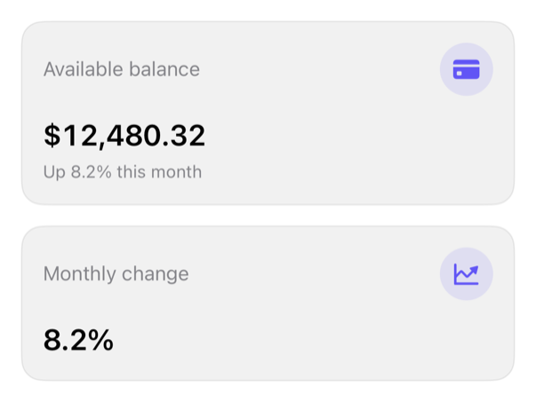

<!-- Generated by `swiftui-registry generate catalog` from Registry metadata. Do not edit by hand; edit the item document and regenerate. -->

# metric-card

Displays one prepared product metric using native text formatting and semantic styling.



More previews: [dark](../images/items/metric-card-dark.png)

## Install

```sh
swiftui-registry install metric-card --destination Sources/YourFeature/Components
```

Point `--destination` at a folder inside the consuming target's sources, such as `Sources/YourFeature/Components`, so the copied files are members of that build target

Then add package https://github.com/mangobyte-dev/swiftui-ui-registry.git (from 0.1.0 up to the next minor version) and link product SwiftUIRegistryFoundations

```swift
// Package.swift
dependencies: [
    .package(url: "https://github.com/mangobyte-dev/swiftui-ui-registry.git", .upToNextMinor(from: "0.1.0"))
]

// In the consuming target's dependencies:
.product(name: "SwiftUIRegistryFoundations", package: "swiftui-ui-registry")
```

In an Xcode app project instead, choose File > Add Package Dependency, enter https://github.com/mangobyte-dev/swiftui-ui-registry.git with the same version rule, and add the SwiftUIRegistryFoundations product to your app target

Verify the install by building the consuming target for an iOS Simulator destination

## Usage

```swift
MetricCard(
    "Available balance",
    value: Text(12_480.32, format: .currency(code: "USD")),
    detail: Text("Up 8.2% this month"),
    systemImage: "creditcard.fill"
)
```

## Details

- Kind: component
- Version: 0.2.1
- Platforms: iOS 26.0+
- Registry dependencies: none
- Accessibility contract:
  - Uses system text styles for Dynamic Type.
  - Combines title, value, and detail into one VoiceOver element.
  - Treats the SF Symbol as decorative; its circle scales with the body text style.
- Source: [sources/components/MetricCard.swift](../../Registry/sources/components/MetricCard.swift), with the `Metric Card` Xcode preview
