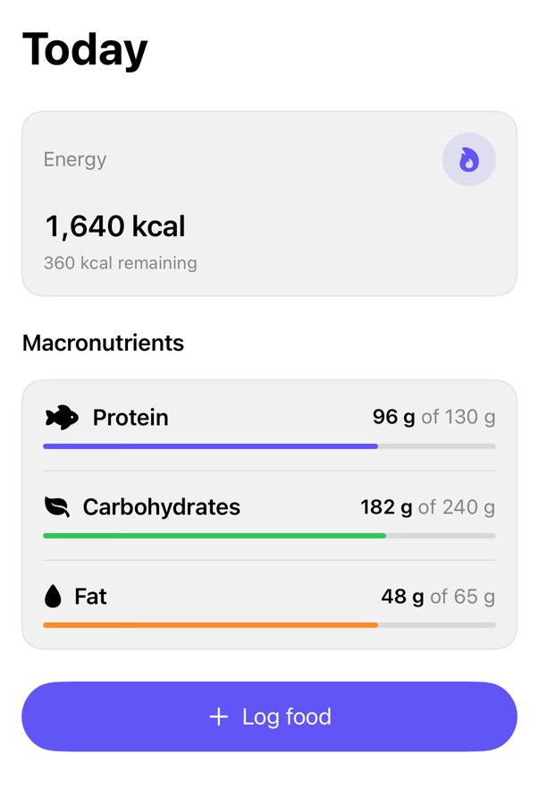

<!-- Generated by `swiftui-registry generate catalog` from Registry metadata. Do not edit by hand; edit the item document and regenerate. -->

# nutrition-overview

Composes prepared energy and macronutrient values into an embeddable nutrition overview.



More previews: [dark](../images/items/nutrition-overview-dark.png)

## Install

```sh
swiftui-registry install nutrition-overview --destination Sources/YourFeature/Components
```

Point `--destination` at a folder inside the consuming target's sources, such as `Sources/YourFeature/Components`, so the copied files are members of that build target

Then add package https://github.com/mangobyte-dev/swiftui-ui-registry.git (from 0.3.0 up to the next minor version) and link product SwiftUIRegistryFoundations

```swift
// Package.swift
dependencies: [
    .package(url: "https://github.com/mangobyte-dev/swiftui-ui-registry.git", .upToNextMinor(from: "0.3.0"))
]

// In the consuming target's dependencies:
.product(name: "SwiftUIRegistryFoundations", package: "swiftui-ui-registry")
```

In an Xcode app project instead, choose File > Add Package Dependency, enter https://github.com/mangobyte-dev/swiftui-ui-registry.git with the same version rule, and add the SwiftUIRegistryFoundations product to your app target

Verify the install by building the consuming target for an iOS Simulator destination

## Usage

```swift
NutritionOverview(
    "Today",
    energyTitle: "Energy",
    energy: Text("1,640 kcal"),
    energyDetail: Text("360 kcal remaining"),
    sectionTitle: "Macronutrients",
    macros: [
        NutritionMacroItem(
            id: "protein",
            name: "Protein",
            value: Text("96 g"),
            target: Text("130 g"),
            progress: 96.0 / 130.0,
            systemImage: "fish.fill",
            tint: .indigo
        )
    ],
    actionTitle: "Log food",
    onLogFood: {}
)
```

## Details

- Kind: block
- Version: 0.2.3
- Platforms: iOS 26.0+
- Installs in order: [metric-card](metric-card.md) 0.2.2, [macro-progress](macro-progress.md) 0.4.1, [nutrition-overview](nutrition-overview.md) 0.2.3
- Accessibility contract:
  - The overview uses native Button and ProgressView semantics. The screen and section titles carry the header trait.
  - The overview uses system text styles and adaptive macro rows for Dynamic Type.
  - The overview accepts prepared values, so callers keep localization and measurement-format control.
- Source: [sources/blocks/NutritionOverview.swift](../../Registry/sources/blocks/NutritionOverview.swift), with the `Nutrition Overview` Xcode preview
