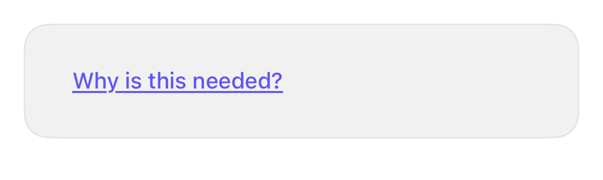

<!-- Generated by `swiftui-registry generate catalog` from Registry metadata. Do not edit by hand; edit the item document and regenerate. -->

# popover

`.popover` guidance.



More previews: [dark](../images/items/popover-dark.png)

Nothing to install. Copy the snippet below

## Usage

```swift
@State private var isShowingHelp = false

Button("Why is this needed?") { isShowingHelp = true }
    .buttonStyle(.registryLink)
    .popover(isPresented: $isShowingHelp) {
        Text("We use your date of birth to verify your identity.")
            .padding()
            .presentationCompactAdaptation(.popover)
    }
```

## Why native is enough

`.popover` anchors content; iPhone: sheet unless `.presentationCompactAdaptation(.popover)`. System: arrow, no dim, outside-tap dismiss. No wrapper.

## Details

- Kind: recipe
- Version: 0.1.0
- Platforms: iOS 26.0+
- Accessibility contract:
  - Popover: VoiceOver-reachable, escape-dismissed.
  - Info MUST NOT live only in popover; label MUST stand alone.
