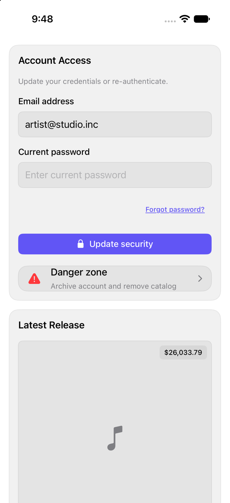

<!-- Generated by Scripts/generate_catalog.py from Registry metadata. Do not edit by hand; edit the item document and regenerate. -->

# preview-02

The second theme preview wall from shadcn's create page: realistic product cards built from registry components and native controls, laid out as an adaptive grid on a regular width and a single column on a compact width, so a theme can be judged against a second screen of real UI.



More previews: [dark](../images/items/preview-02-dark.png)

## Install

```sh
python3 Scripts/install.py preview-02 --destination Sources/YourFeature/Components
```

Point `--destination` at a folder inside the consuming target's sources, such as `Sources/YourFeature/Components`, so the copied files are members of that build target

Then add package https://github.com/mangobyte-dev/swiftui-ui-registry.git (from 0.1.0 up to the next minor version) and link product SwiftUIRegistryFoundations

```swift
// Package.swift
dependencies: [
    .package(url: "https://github.com/mangobyte-dev/swiftui-ui-registry.git", .upToNextMinor(from: "0.1.0"))
]

// In the consuming target's dependencies:
.product(name: "SwiftUIRegistryFoundations", package: "swiftui-ui-registry")
```

In an Xcode app project instead, choose File > Add Package Dependency, enter https://github.com/mangobyte-dev/swiftui-ui-registry.git with the same version rule, and add the SwiftUIRegistryFoundations product to your app target

Verify the install by building the consuming target for an iOS Simulator destination

## Usage

```swift
PreviewWall02()
```

## Details

- Kind: block
- Version: 0.2.0
- Platforms: iOS 26.0+
- Installs in order: [card](card.md) 0.2.0, [input](input.md) 0.5.0, [field](field.md) 0.1.0, [button](button.md) 0.5.0, [avatar](avatar.md) 0.2.0, [separator](separator.md) 0.2.0, [badge](badge.md) 0.3.1, [item](item.md) 0.2.0, [chart](chart.md) 0.1.1, [input-group](input-group.md) 0.2.0, [toggle](toggle.md) 0.2.0, [toggle-group](toggle-group.md) 0.2.0, [empty](empty.md) 0.1.0, [accordion](accordion.md) 0.2.0, [skeleton](skeleton.md) 0.2.0, [checkbox](checkbox.md) 0.3.0, [breadcrumb](breadcrumb.md) 0.1.0, [select](select.md) 0.2.0, [textarea](textarea.md) 0.4.0, [progress](progress.md) 0.2.0, [table](table.md) 0.1.0, [preview-02](preview-02.md) 0.2.0
- Accessibility contract:
  - The cards render in one ordered wall: an adaptive grid on a regular width and a plain, non-lazy VStack on a compact width, so every card exists in the hierarchy even off screen and the capture-route accessibility audit reaches all of them.
  - Every interactive control carries an accessibility label and every decorative SF Symbol is hidden, so the capture-route audit finds no unlabeled button, image, switch, text field, or slider on any card.
  - Each card is a native GroupBox on the shared card surface and composes native controls, so Dynamic Type, color scheme, and layout direction are respected without per-card handling.
- Source:
  - [sources/blocks/Preview02/PreviewWall02.swift](../../Registry/sources/blocks/Preview02/PreviewWall02.swift), with the `Preview Wall 02` Xcode preview
  - [sources/blocks/Preview02/AccountAccess.swift](../../Registry/sources/blocks/Preview02/AccountAccess.swift)
  - [sources/blocks/Preview02/AlbumCard.swift](../../Registry/sources/blocks/Preview02/AlbumCard.swift)
  - [sources/blocks/Preview02/CardOverview.swift](../../Registry/sources/blocks/Preview02/CardOverview.swift)
  - [sources/blocks/Preview02/CatalogToolbar.swift](../../Registry/sources/blocks/Preview02/CatalogToolbar.swift)
  - [sources/blocks/Preview02/ClaimableBalance.swift](../../Registry/sources/blocks/Preview02/ClaimableBalance.swift)
  - [sources/blocks/Preview02/ContributionHistory.swift](../../Registry/sources/blocks/Preview02/ContributionHistory.swift)
  - [sources/blocks/Preview02/CoverArt.swift](../../Registry/sources/blocks/Preview02/CoverArt.swift)
  - [sources/blocks/Preview02/DividendIncome.swift](../../Registry/sources/blocks/Preview02/DividendIncome.swift)
  - [sources/blocks/Preview02/EmptyConnectBank.swift](../../Registry/sources/blocks/Preview02/EmptyConnectBank.swift)
  - [sources/blocks/Preview02/EmptyDistributeTrack.swift](../../Registry/sources/blocks/Preview02/EmptyDistributeTrack.swift)
  - [sources/blocks/Preview02/EmptyExploreCatalog.swift](../../Registry/sources/blocks/Preview02/EmptyExploreCatalog.swift)
  - [sources/blocks/Preview02/Faq.swift](../../Registry/sources/blocks/Preview02/Faq.swift)
  - [sources/blocks/Preview02/FrontDoor.swift](../../Registry/sources/blocks/Preview02/FrontDoor.swift)
  - [sources/blocks/Preview02/IndexInvesting.swift](../../Registry/sources/blocks/Preview02/IndexInvesting.swift)
  - [sources/blocks/Preview02/KitchenIsland.swift](../../Registry/sources/blocks/Preview02/KitchenIsland.swift)
  - [sources/blocks/Preview02/LoadingCard.swift](../../Registry/sources/blocks/Preview02/LoadingCard.swift)
  - [sources/blocks/Preview02/NewMilestone.swift](../../Registry/sources/blocks/Preview02/NewMilestone.swift)
  - [sources/blocks/Preview02/NotificationSettings.swift](../../Registry/sources/blocks/Preview02/NotificationSettings.swift)
  - [sources/blocks/Preview02/Payments.swift](../../Registry/sources/blocks/Preview02/Payments.swift)
  - [sources/blocks/Preview02/PayoutThreshold.swift](../../Registry/sources/blocks/Preview02/PayoutThreshold.swift)
  - [sources/blocks/Preview02/PowerUsage.swift](../../Registry/sources/blocks/Preview02/PowerUsage.swift)
  - [sources/blocks/Preview02/Preferences.swift](../../Registry/sources/blocks/Preview02/Preferences.swift)
  - [sources/blocks/Preview02/QrConnect.swift](../../Registry/sources/blocks/Preview02/QrConnect.swift)
  - [sources/blocks/Preview02/ReceivingMethod.swift](../../Registry/sources/blocks/Preview02/ReceivingMethod.swift)
  - [sources/blocks/Preview02/RecentTransactions.swift](../../Registry/sources/blocks/Preview02/RecentTransactions.swift)
  - [sources/blocks/Preview02/ReleaseCatalog.swift](../../Registry/sources/blocks/Preview02/ReleaseCatalog.swift)
