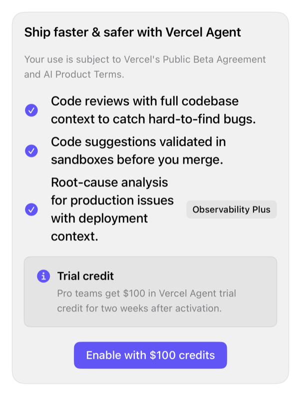

<!-- Generated by `swiftui-registry generate catalog` from Registry metadata. Do not edit by hand; edit the item document and regenerate. -->

# preview

Theme wall: 33 cards, registry + native; adaptive grid, compact one-column.



More previews: [dark](../images/items/preview-dark.png)

## Install

```sh
swiftui-registry install preview --destination Sources/YourFeature/Components
```

Point `--destination` at a folder inside the consuming target's sources, such as `Sources/YourFeature/Components`, so the copied files are members of that build target

Then add package https://github.com/mangobyte-dev/swiftui-ui-registry.git (from 0.3.0 up to the next minor version) and link product SwiftUIRegistryFoundations

```swift
// Package.swift
dependencies: [
    .package(url: "https://github.com/mangobyte-dev/swiftui-ui-registry.git", .upToNextMinor(from: "0.3.0"))
]

// In the consuming target's dependencies:
.product(name: "SwiftUIRegistryFoundations", package: "swiftui-ui-registry")
```

In an Xcode app project instead, choose File > Add Package Dependency, enter https://github.com/mangobyte-dev/swiftui-ui-registry.git with the same version rule, and add the SwiftUIRegistryFoundations product to your app target

Verify the install by building the consuming target for an iOS Simulator destination

## Usage

```swift
PreviewWall()
```

## Details

- Kind: block
- Version: 0.3.1
- Platforms: iOS 26.0+
- Installs in order: [card](card.md) 0.2.1, [avatar](avatar.md) 0.2.1, [separator](separator.md) 0.2.1, [badge](badge.md) 0.3.2, [item](item.md) 0.2.1, [button](button.md) 0.5.2, [alert](alert.md) 0.2.1, [chart](chart.md) 0.1.3, [empty](empty.md) 0.1.1, [input-group](input-group.md) 0.2.1, [combobox](combobox.md) 0.1.1, [input](input.md) 0.5.1, [field](field.md) 0.1.1, [spinner](spinner.md) 0.2.1, [checkbox](checkbox.md) 0.3.2, [textarea](textarea.md) 0.4.1, [table](table.md) 0.1.1, [kbd](kbd.md) 0.1.2, [progress](progress.md) 0.2.1, [select](select.md) 0.2.1, [skeleton](skeleton.md) 0.2.1, [button-group](button-group.md) 0.3.2, [preview](preview.md) 0.3.1
- Accessibility contract:
  - 33 cards, one wall; regular: adaptive grid; compact: plain-non-lazy-VStack, all off-screen too (capture-route audit).
  - Controls: accessibility label; SF Symbol hidden; no unlabeled button, image, switch, field, slider.
  - Avatars: person/account name label. Charts, gauges, keycaps: spoken labels, not glyphs.
  - Dialog actions: native alert/sheet; keeps modal semantics, focus.
  - Cards: native GroupBox + controls, card-surface; respects Dynamic Type, color-scheme, direction, no-per-card-handling.
- Source:
  - [sources/blocks/Preview/PreviewWall.swift](../../Registry/sources/blocks/Preview/PreviewWall.swift), with the `Preview Wall` Xcode preview
  - [sources/blocks/Preview/ActivateAgentDialog.swift](../../Registry/sources/blocks/Preview/ActivateAgentDialog.swift)
  - [sources/blocks/Preview/AnalyticsCard.swift](../../Registry/sources/blocks/Preview/AnalyticsCard.swift)
  - [sources/blocks/Preview/AnomalyAlert.swift](../../Registry/sources/blocks/Preview/AnomalyAlert.swift)
  - [sources/blocks/Preview/AssignIssue.swift](../../Registry/sources/blocks/Preview/AssignIssue.swift)
  - [sources/blocks/Preview/BarChartCard.swift](../../Registry/sources/blocks/Preview/BarChartCard.swift)
  - [sources/blocks/Preview/BarVisualizer.swift](../../Registry/sources/blocks/Preview/BarVisualizer.swift)
  - [sources/blocks/Preview/BookAppointment.swift](../../Registry/sources/blocks/Preview/BookAppointment.swift)
  - [sources/blocks/Preview/CodespacesCard.swift](../../Registry/sources/blocks/Preview/CodespacesCard.swift)
  - [sources/blocks/Preview/ContributionsActivity.swift](../../Registry/sources/blocks/Preview/ContributionsActivity.swift)
  - [sources/blocks/Preview/Contributors.swift](../../Registry/sources/blocks/Preview/Contributors.swift)
  - [sources/blocks/Preview/EnvironmentVariables.swift](../../Registry/sources/blocks/Preview/EnvironmentVariables.swift)
  - [sources/blocks/Preview/FeedbackForm.swift](../../Registry/sources/blocks/Preview/FeedbackForm.swift)
  - [sources/blocks/Preview/FileUpload.swift](../../Registry/sources/blocks/Preview/FileUpload.swift)
  - [sources/blocks/Preview/DeveloperProfile.swift](../../Registry/sources/blocks/Preview/DeveloperProfile.swift)
  - [sources/blocks/Preview/IconPreviewGrid.swift](../../Registry/sources/blocks/Preview/IconPreviewGrid.swift)
  - [sources/blocks/Preview/InviteTeam.swift](../../Registry/sources/blocks/Preview/InviteTeam.swift)
  - [sources/blocks/Preview/Invoice.swift](../../Registry/sources/blocks/Preview/Invoice.swift)
  - [sources/blocks/Preview/LiveWaveform.swift](../../Registry/sources/blocks/Preview/LiveWaveform.swift)
  - [sources/blocks/Preview/NoTeamMembers.swift](../../Registry/sources/blocks/Preview/NoTeamMembers.swift)
  - [sources/blocks/Preview/NotFound.swift](../../Registry/sources/blocks/Preview/NotFound.swift)
  - [sources/blocks/Preview/ObservabilityCard.swift](../../Registry/sources/blocks/Preview/ObservabilityCard.swift)
  - [sources/blocks/Preview/PieChartCard.swift](../../Registry/sources/blocks/Preview/PieChartCard.swift)
  - [sources/blocks/Preview/ReportBug.swift](../../Registry/sources/blocks/Preview/ReportBug.swift)
  - [sources/blocks/Preview/ShippingAddress.swift](../../Registry/sources/blocks/Preview/ShippingAddress.swift)
  - [sources/blocks/Preview/Shortcuts.swift](../../Registry/sources/blocks/Preview/Shortcuts.swift)
  - [sources/blocks/Preview/SkeletonLoading.swift](../../Registry/sources/blocks/Preview/SkeletonLoading.swift)
  - [sources/blocks/Preview/SleepReport.swift](../../Registry/sources/blocks/Preview/SleepReport.swift)
  - [sources/blocks/Preview/StyleOverview.swift](../../Registry/sources/blocks/Preview/StyleOverview.swift)
  - [sources/blocks/Preview/TypographySpecimen.swift](../../Registry/sources/blocks/Preview/TypographySpecimen.swift)
  - [sources/blocks/Preview/UIElements.swift](../../Registry/sources/blocks/Preview/UIElements.swift)
  - [sources/blocks/Preview/UsageCard.swift](../../Registry/sources/blocks/Preview/UsageCard.swift)
  - [sources/blocks/Preview/Visitors.swift](../../Registry/sources/blocks/Preview/Visitors.swift)
  - [sources/blocks/Preview/WeeklyFitnessSummary.swift](../../Registry/sources/blocks/Preview/WeeklyFitnessSummary.swift)
