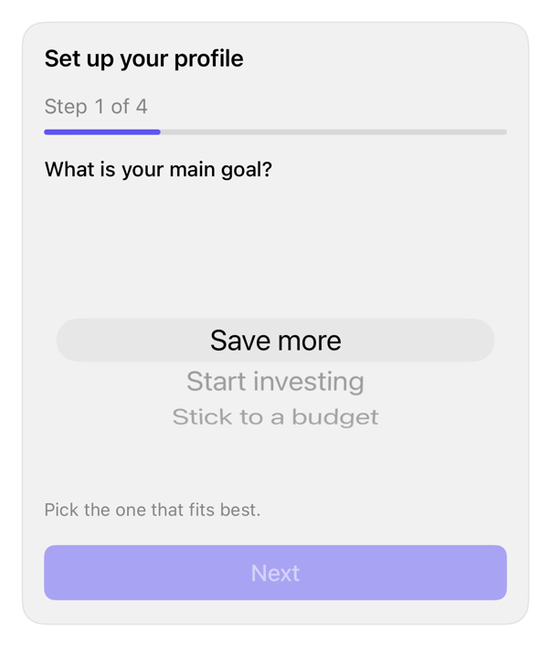

<!-- Generated by `swiftui-registry generate catalog` from Registry metadata. Do not edit by hand; edit the item document and regenerate. -->

# questionnaire

Composes the registry field, checkbox, textarea, progress, button, and card treatments into a caller-driven multi-step questionnaire with single-choice, multiple-choice, freeform, and skippable steps.



More previews: [dark](../images/items/questionnaire-dark.png)

## Install

```sh
swiftui-registry install questionnaire --destination Sources/YourFeature/Components
```

Point `--destination` at a folder inside the consuming target's sources, such as `Sources/YourFeature/Components`, so the copied files are members of that build target

Then add package https://github.com/mangobyte-dev/swiftui-ui-registry.git (from 0.3.0 up to the next minor version) and link product SwiftUIRegistryFoundations

```swift
// Package.swift
dependencies: [
    .package(url: "https://github.com/mangobyte-dev/swiftui-ui-registry.git", .upToNextMinor(from: "0.3.0"))
]

// In the consuming target's dependencies:
.product(name: "SwiftUIRegistryFoundations", package: "swiftui-ui-registry")
```

In an Xcode app project instead, choose File > Add Package Dependency, enter https://github.com/mangobyte-dev/swiftui-ui-registry.git with the same version rule, and add the SwiftUIRegistryFoundations product to your app target

Verify the install by building the consuming target for an iOS Simulator destination

## Usage

```swift
@State private var currentStep = 0
@State private var answers: [String: QuestionnaireAnswer] = [:]

Questionnaire(
    "Set up your profile",
    steps: [
        QuestionnaireStep(
            id: "goal",
            title: "What is your main goal?",
            kind: .singleChoice([
                QuestionnaireOption(id: "save", title: "Save more"),
                QuestionnaireOption(id: "invest", title: "Start investing")
            ])
        )
    ],
    currentStep: $currentStep,
    answers: $answers,
    onFinish: { }
)
```

## Details

- Kind: block
- Version: 0.1.1
- Platforms: iOS 26.0+
- Installs in order: [input](input.md) 0.5.1, [field](field.md) 0.1.1, [checkbox](checkbox.md) 0.3.2, [textarea](textarea.md) 0.4.1, [progress](progress.md) 0.2.1, [button](button.md) 0.5.2, [card](card.md) 0.2.1, [questionnaire](questionnaire.md) 0.1.1
- Accessibility contract:
  - The card title carries the header accessibility trait, so VoiceOver reaches the questionnaire heading directly.
  - The step counter reads as 'Step N of M' in monospaced digits. The ProgressView carries an explicit 'Progress' accessibility label with the completed fraction as its value.
  - Each step is a Field whose visible label is the step title. Single choice is a native inline Picker whose options stay reachable as native picker rows. Multiple choice is a column of checkbox Toggles, each labeled by its option title. Freeform is a TextEditor whose accessibility label is the step's prompt.
  - A step forward or back posts an AccessibilityNotification.Announcement of the new step's title, so VoiceOver states where the caller landed.
  - The Back, Skip, and Next or Finish buttons each carry an explicit accessibility label. Next stays disabled until the step has an answer, unless the step is skippable. The button row reflows from a row to a column through ViewThatFits, so labels never truncate under Dynamic Type.
- Source: [sources/blocks/Questionnaire.swift](../../Registry/sources/blocks/Questionnaire.swift), with the `Questionnaire` Xcode preview
