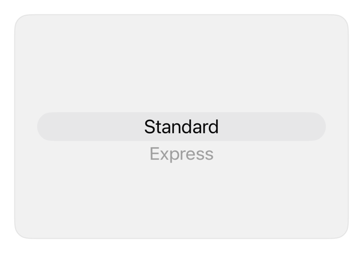

<!-- Generated by `swiftui-registry generate catalog` from Registry metadata. Do not edit by hand; edit the item document and regenerate. -->

# radio-group

Picker: inline exclusive group.



More previews: [dark](../images/items/radio-group-dark.png)

Nothing to install. Copy the snippet below

## Usage

```swift
@State private var selection = "standard"

Picker("Delivery speed", selection: $selection) {
    Text("Standard").tag("standard")
    Text("Express").tag("express")
    Text("Same day").tag("same-day")
}
.pickerStyle(.inline)
```

## Why native is enough

`.pickerStyle(.inline)`: exclusive group; no wrapper.

## Details

- Kind: recipe
- Version: 0.3.0
- Platforms: iOS 26.0+
- Accessibility contract:
  - Retains Picker selection, option semantics; caller-owned via binding.
  - Visible labels, native selected-state; inherits Dynamic Type, enabled, direction.
