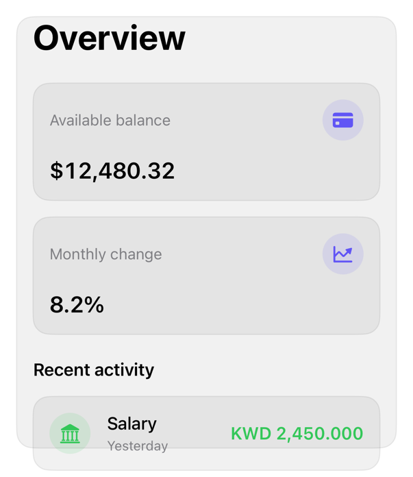

<!-- Generated by `swiftui-registry generate catalog` from Registry metadata. Do not edit by hand; edit the item document and regenerate. -->

# scroll-area

Scrollable content: margins, indicators, clipping.



More previews: [dark](../images/items/scroll-area-dark.png)

Nothing to install. Copy the snippet below

## Usage

```swift
ScrollView {
    FinanceOverview(
        "Overview",
        balanceTitle: "Available balance",
        balance: Text(12_480.32, format: .currency(code: "USD")),
        changeTitle: "Monthly change",
        change: Text(0.082, format: .percent),
        sectionTitle: "Recent activity",
        transactions: rows,
        onSelect: { id in }
    )
}
.contentMargins(.horizontal, 16, for: .scrollContent)
.scrollIndicators(.hidden)
.scrollClipDisabled()
.scrollEdgeEffectStyle(.soft, for: .top)
```

## Why native is enough

`ScrollView` + `.contentMargins`, `.scrollIndicators`, `.scrollClipDisabled`; scrolling/bounce/keyboard system-owned, not blocks. `.scrollEdgeEffectStyle`: content-to-glass transition, replaces background (HIG Layout).

## Details

- Kind: recipe
- Version: 0.2.0
- Platforms: iOS 26.0+
- Accessibility contract:
  - Native scroll: VoiceOver page-scroll, three-finger gesture.
  - Hidden indicators remove sighted affordance; prefer .automatic for long content.
