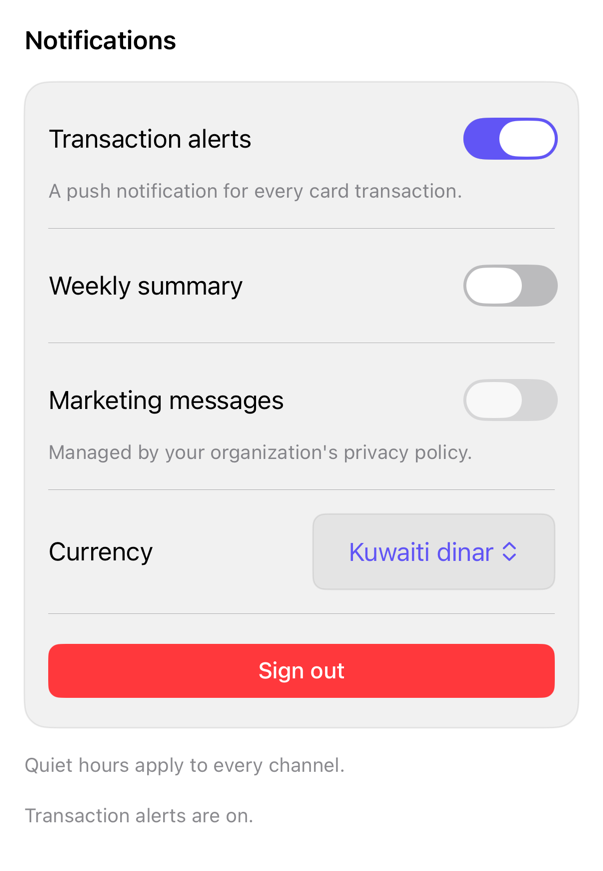

<!-- Generated by `swiftui-registry generate catalog` from Registry metadata. Do not edit by hand; edit the item document and regenerate. -->

# settings-section

Composes registry select, separator, and button treatments into a titled settings section that renders structure, separators, and per-row messages around caller-owned native toggle, picker, and action rows.



More previews: [dark](../images/items/settings-section-dark.png)

## Install

```sh
swiftui-registry install settings-section --destination Sources/YourFeature/Components
```

Point `--destination` at a folder inside the consuming target's sources, such as `Sources/YourFeature/Components`, so the copied files are members of that build target

Then add package https://github.com/mangobyte-dev/swiftui-ui-registry.git (from 0.1.0 up to the next minor version) and link product SwiftUIRegistryFoundations

```swift
// Package.swift
dependencies: [
    .package(url: "https://github.com/mangobyte-dev/swiftui-ui-registry.git", .upToNextMinor(from: "0.1.0"))
]

// In the consuming target's dependencies:
.product(name: "SwiftUIRegistryFoundations", package: "swiftui-ui-registry")
```

In an Xcode app project instead, choose File > Add Package Dependency, enter https://github.com/mangobyte-dev/swiftui-ui-registry.git with the same version rule, and add the SwiftUIRegistryFoundations product to your app target

Verify the install by building the consuming target for an iOS Simulator destination

## Usage

```swift
SettingsSection(
    "Notifications",
    footer: Text("Quiet hours apply to every channel.")
) {
    Toggle("Transaction alerts", isOn: $alertsEnabled)
        .settingsRowDescription(Text("A push notification for every card transaction."))

    Toggle("Marketing messages", isOn: $marketingEnabled)
        .settingsRowDisabled(
            !marketingAllowed,
            explanation: Text("Managed by your organization's privacy policy.")
        )

    LabeledContent("Currency") {
        Picker("Currency", selection: $currency) {
            Text("Kuwaiti dinar").tag("KWD")
            Text("US dollar").tag("USD")
        }
        .registrySelect()
    }

    Button("Sign out", role: .destructive) { }
        .buttonStyle(.registry)
}
```

## Details

- Kind: block
- Version: 0.1.1
- Platforms: iOS 26.0+
- Installs in order: [select](select.md) 0.2.0, [separator](separator.md) 0.2.0, [button](button.md) 0.5.0, [settings-section](settings-section.md) 0.1.1
- Accessibility contract:
  - The section title renders with the header accessibility trait so the VoiceOver rotor can jump between settings sections.
  - Rows keep native control semantics: the block never hides or renames a control, and every control's accessibility name comes from its visible label. Callers who hide a label (.labelsHidden()) must supply their own accessibility label.
  - settingsRowDisabled composes native .disabled, so a disabled control dims through its own style treatment and is announced as dimmed by VoiceOver, while the description and explanation render outside the disabled subtree at full secondary contrast.
  - A disabled row's explanation is visible static text in reading order directly under the control, not an accessibility hint, so nothing double-announces. An enabled row with an explanation is unrepresentable: the modifier clears the explanation when isDisabled is false.
  - Reading order per row is control, then description, then explanation, then the section footer, following caller declaration order for VoiceOver and Full Keyboard Access.
  - Text uses system styles (.headline, .footnote) with a 44-point minimum row control height and no fixed heights, so Dynamic Type and right-to-left layouts reflow. Rotor grouping of row chrome (.accessibilityElement(children: .contain)) is deliberately not applied, so each control stays its own element.
- Source: [sources/blocks/SettingsSection.swift](../../Registry/sources/blocks/SettingsSection.swift), with the `Settings Section` Xcode preview
