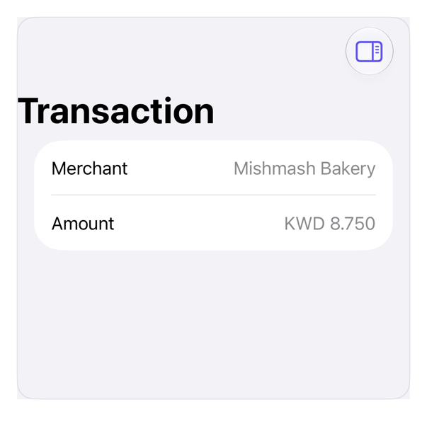

<!-- Generated by `swiftui-registry generate catalog` from Registry metadata. Do not edit by hand; edit the item document and regenerate. -->

# sheet

Side sheet: iPad inspector, iPhone sheet.



More previews: [dark](../images/items/sheet-dark.png)

Nothing to install. Copy the snippet below

## Usage

```swift
@State private var isShowingDetails = false

NavigationStack {
    List {
        LabeledContent("Merchant", value: "Mishmash Bakery")
        LabeledContent("Amount", value: "KWD 8.750")
    }
    .navigationTitle("Transaction")
    .toolbar {
        ToolbarItem(placement: .topBarTrailing) {
            Button("Details", systemImage: "sidebar.trailing") {
                isShowingDetails.toggle()
            }
            .accessibilityLabel("Toggle details")
        }
    }
    .inspector(isPresented: $isShowingDetails) {
        List {
            LabeledContent("Category", value: "Dining")
            LabeledContent("Card", value: "Visa 4321")
            LabeledContent("Status", value: "Cleared")
        }
        .inspectorColumnWidth(min: 240, ideal: 280, max: 360)
    }
}
```

## Why native is enough

`.inspector`: trailing column iPadOS, sheet iPhone; sized via `.inspectorColumnWidth`. `dialog`/`drawer` cover plain sheet. iOS 27: tab-attached inspector stopped text-field focus. Attach above stack, or use `.sheet` in text-field tabs.

## Details

- Kind: recipe
- Version: 0.1.0
- Platforms: iOS 26.0+
- Accessibility contract:
  - Inspector toggle: labeled button; panel: VoiceOver-reachable.
  - iPhone: inspector adapts to sheet, system dismiss.
